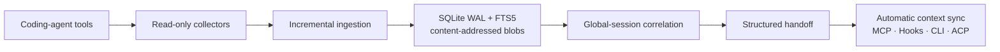
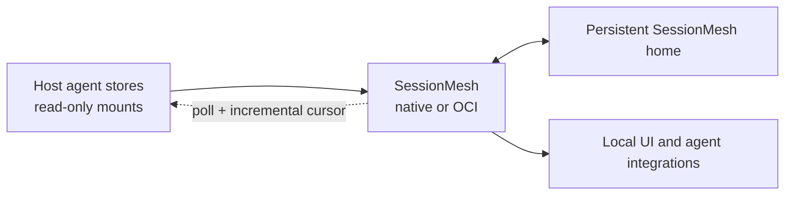

# SessionMesh

[](LICENSE)


SessionMesh is a local-first observability, correlation, and handoff layer for
heterogeneous coding-agent sessions.

It watches native session sources without modifying them, stores immutable raw
imports, normalizes traceable events, correlates related work through a global
session graph, and gives the next agent a compact current handoff.

Synchronization is automatic: collectors update the shared state continuously,
and supported connectors deliver derived context through MCP, hooks, ACP, local
APIs, or wrappers. Native transcripts are never rewritten.

> Native sessions are not destructively merged. They remain owned and resumable
> by their original tools.

## Architecture



## First-release focus

1. Import Codex sessions incrementally and idempotently.
2. Normalize native events with complete provenance.
3. Manage cross-tool global sessions through reversible references.
4. Deliver compact, progressively disclosed handoffs through MCP.

## Runtime model

SessionMesh is designed to run:

- natively as a user service; or
- as the same non-root OCI image under Docker or Podman.

Containers persist `SESSIONMESH_HOME=/var/lib/sessionmesh`. Native agent stores
are mounted separately and read-only below `/sources/<tool>`.



See the [deployment model](docs/architecture/deployment.md) for the mount and
security contract.

## Configuration

Copy the safe template for local development:

```bash
cp .env.example .env
```

`.env`, local settings, credentials, private keys, authentication exports,
runtime databases, and SessionMesh state are excluded from Git. Never place
real secrets in `.env.example`, documentation, fixtures, logs, or commits.
See the [security policy](SECURITY.md) before publishing or reporting a
vulnerability.

Important variables:

| Variable                            | Default or example                 | Purpose                            |
| ----------------------------------- | ---------------------------------- | ---------------------------------- |
| `SESSIONMESH_HOME`                  | `/var/lib/sessionmesh`             | Persistent service state           |
| `SESSIONMESH_BIND_ADDRESS`          | `127.0.0.1`                        | Local API bind address             |
| `SESSIONMESH_PORT`                  | `8787`                             | Local API port                     |
| `SESSIONMESH_PUBLISH_ADDRESS`       | `127.0.0.1`                        | OCI host publish address           |
| `SESSIONMESH_ALLOW_NETWORK`         | `false`                            | Explicit remote-network opt-in     |
| `SESSIONMESH_WEB_ROOT`              | `/usr/share/sessionmesh/web`       | Built web application directory    |
| `SESSIONMESH_DATABASE_PATH`         | `$SESSIONMESH_HOME/sessionmesh.db` | SQLite database                    |
| `SESSIONMESH_BLOB_STORE_PATH`       | `$SESSIONMESH_HOME/blobs`          | Content-addressed raw store        |
| `SESSIONMESH_WATCH_DEBOUNCE_MS`     | `750`                              | Source watcher debounce            |
| `SESSIONMESH_REDACTION_ENABLED`     | `true`                             | Redact before derived processing   |
| `SESSIONMESH_EMBEDDING_ENDPOINT`    | empty                              | Optional local embedding endpoint  |
| `SESSIONMESH_LLM_ENDPOINT`          | empty                              | Optional local extraction endpoint |
| `SESSIONMESH_MODEL`                 | empty                              | Optional local model identifier    |
| `SESSIONMESH_TOKEN_BUDGET`          | `4000`                             | Maximum handoff budget             |
| `SESSIONMESH_CORRELATION_THRESHOLD` | `0.8`                              | Automatic-link threshold           |
| `SESSIONMESH_AGENT_HOME`            | `${HOME}`                          | Read-only host agent-profile root  |
| `SESSIONMESH_RUN_UID`               | `10001`                            | Container UID; match profile owner |
| `SESSIONMESH_RUN_GID`               | `10001`                            | Container GID; match profile owner |
| `SESSIONMESH_PROFILE_ROOT`          | `/sources/home`                    | Container-readable profile root    |
| `SESSIONMESH_PROFILE_ORIGINAL_ROOT` | `${HOME}`                          | Host provenance path label         |
| `CODEX_HOME`                        | `$HOME/.codex`                     | Native Codex source outside OCI    |

The complete precedence, validation, and path-expansion contract is documented
in [Configuration](docs/development/configuration.md).

On first daemon start, SessionMesh generates a 256-bit local API token at
`$SESSIONMESH_HOME/api-token` with user-only permissions. Read it from the
persistent state volume when configuring local clients. It is runtime state and
must never be copied into `.env`, `.env.example`, documentation, or Git.

## Project state

The MVP implementation includes active Codex, Claude Code, Continue, OpenCode,
and Agy ingestion, immutable raw and canonical storage, authenticated REST/SSE,
the responsive timeline, explainable audited global-session correlation,
thread-title navigation with topic/date/size organization, cross-tool keyword
search, human-readable event content, deterministic handoff
refresh, and stdio MCP/startup delivery. The
[implementation ledger](docs/development/implementation-status.md) records the
verified scope and remaining limitations.

- [Complete project plan](docs/architecture/project-plan.md)
- [Architecture decisions](docs/adr/index.md)
- [Engineering standards](docs/development/engineering-standards.md)
- [Implementation status](docs/development/implementation-status.md)
- [Prompt queue](docs/implementation/prompts/index.md)

## Development

Prerequisites are Rust 1.88, Node.js 20 or newer, and Python with the pinned
documentation requirements.

```bash
npm ci
python -m pip install -r requirements-docs.txt
make check
```

When Rust is not installed on the host, run the Rust gate reproducibly:

```bash
docker run --rm \
  -v "$PWD:/workspace" \
  -w /workspace \
  rust:1.88-bookworm \
  sh -c 'cargo fmt --check &&
    cargo clippy --workspace --all-targets -- -D warnings &&
    cargo test --workspace'
```

Build the OCI image with either runtime:

```bash
docker build -t sessionmesh:local .
podman build -t sessionmesh:local .
```

## Documentation

Install and build the Material for MkDocs site:

```bash
python -m pip install -r requirements-docs.txt
mkdocs serve
mkdocs build --strict
```

## Engineering principles

- English repository artifacts and commit messages
- Test-driven development and Clean Code
- Cause-level fixes instead of workarounds
- Read-only native sources and immutable raw imports
- Deterministic IDs and complete provenance
- Local processing and explicit remote opt-in

## License

Licensed under the [Apache License 2.0](LICENSE).
