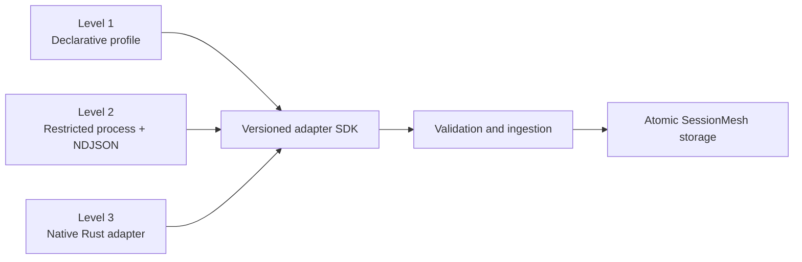

# Adapter SDK and Process Protocol

SessionMesh supports three adapter levels behind one read-only observation
contract.



Declarative profiles cover JSON, JSONL, Markdown, SQLite, command, HTTP, SSE,
ACP, directory, and manual-export sources. Process adapters allow additional
languages without linking untrusted code into the daemon. Native Rust adapters
are reserved for important or performance-sensitive tools.

## Ownership and safety

- SessionMesh supplies only `ReadOnlySource` descriptors. The SDK has no native
  source write operation.
- Discovery is restricted to explicit roots.
- A cursor belongs to one adapter and one source. An adapter proposes progress;
  only ingestion storage commits it with accepted raw objects and events.
- Failed, interrupted, malformed, or cancelled output cannot erase or replace a
  committed cursor.
- Scan sinks are asynchronous so consumers can apply backpressure. Every
  request also has a non-zero event budget.
- Cancellation is cooperative and monotonic.
- Diagnostics are untrusted observations. Their schema has no instruction
  channel and unknown fields are rejected.
- Partial success reports rejected native records separately from valid
  observations.

## Capability behavior

Adapters declare a set of supported operations: discovery, full scan,
incremental scan, watch, and derived-context delivery. Callers reject an
unsupported operation before native I/O. An unsupported capability is distinct
from unhealthy or malformed source data.

## NDJSON negotiation

Each process message is one UTF-8 JSON object terminated by a newline. The
first output message must negotiate protocol `1.0`.

Request:

```json
{ "method": "negotiate", "params": { "versions": ["1.0"] } }
```

Response:

```json
{ "type": "negotiated", "version": "1.0" }
```

Scan request:

```json
{
  "method": "scan",
  "params": {
    "source_id": "codex-rollout",
    "source": {
      "readable_path": "/sources/codex/sessions/rollout.jsonl",
      "original_path": "~/.codex/sessions/rollout.jsonl"
    },
    "cursor": null,
    "event_budget": 500
  }
}
```

Representative output:

```json
{"type":"session","session":{"id":"native-019","started_at":"2026-07-20T14:31:22Z","ended_at":null}}
{"type":"diagnostic","diagnostic":{"code":"unknown-native-record","severity":"warning","message":"Record 18 was retained but not normalized"}}
{"type":"cursor","cursor":{"adapter_id":"codex","source_id":"codex-rollout","source_generation":"device:inode","byte_offset":17428,"partial_record":[]}}
{"type":"complete","completion":"partial","rejected_records":1}
```

Canonical event messages use the versioned
[canonical event](../architecture/canonical-events.md) object.

## Stream validation

The decoder preserves valid messages preceding a failure so partial evidence is
observable, but it never accepts an unterminated final record. It rejects:

- missing or incompatible negotiation;
- malformed JSON or unknown fields;
- duplicate deterministic event IDs;
- unterminated process output; and
- diagnostic attempts to add instruction fields.

The ingestion layer decides whether a valid prefix is committed. Cursor
proposals are committed only in the same transaction as their accepted event
set.
