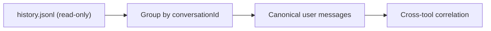

# Agy (Antigravity CLI)

The initial Agy adapter imports the stable, local conversation history at:

```text
~/.gemini/antigravity-cli/history.jsonl
```

Each `conversationId` becomes a native session and each history record becomes
a canonical user message with its workspace and timestamp. The importer never
opens OAuth, token, credential, or account files.



Antigravity's detailed assistant trajectory is stored in protobuf-backed
conversation databases. It is intentionally not guessed or scraped as opaque
bytes. A later adapter revision can add those events once a stable schema or
supported export interface is available.
