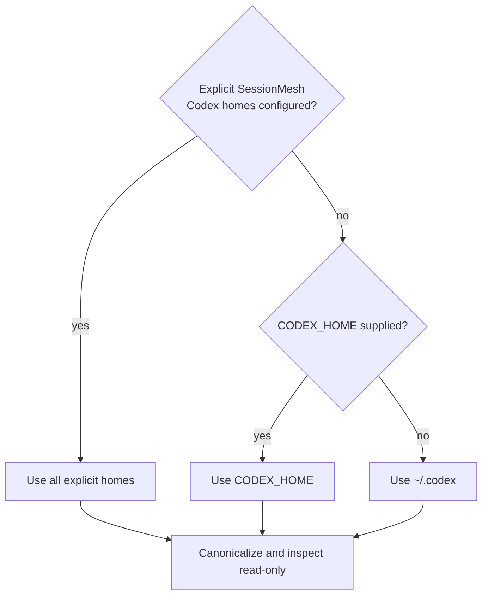
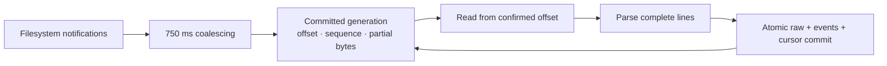

# Codex Discovery

The Codex collector discovers native session sources without modifying,
creating, locking, or changing permissions on files below `CODEX_HOME`.

## Home precedence



Multiple installations are supported through explicit configuration. Native
deployments normally use `$CODEX_HOME` or `~/.codex`. Containers use an explicit
mapping such as:

```toml
[[source_mappings]]
readable_path = "/sources/codex"
original_path = "~/.codex"
```

The runtime path is canonicalized for identity and duplicate detection. The
original path remains unchanged as the user-facing provenance label. Symlinked
homes and rollout aliases therefore do not produce duplicate installations or
sources.

## Recognized sources

Discovery recognizes:

```text
$CODEX_HOME/session_index.jsonl
$CODEX_HOME/sessions/YYYY/MM/DD/rollout-*.jsonl
```

Only exactly dated rollout layouts are traversed. Unrelated content is ignored.
Sources are sorted by kind and canonical identity, making repeated discovery
deterministic.

The optional session index is inspected one line at a time. JSON object records
are counted as valid; malformed lines become diagnostics and do not hide valid
rollouts. Parsing the full index schema and rollout events belongs to the Codex
parser stage.

## Reported metadata

Each installation reports:

- canonical identity;
- readable runtime home and original display home;
- configuration origin;
- Codex CLI surface;
- discovered session-index and rollout sources;
- runtime and original paths;
- platform read-only flag and Unix mode where available;
- read-open status; and
- valid and malformed index-entry counts.

## Troubleshooting

| Diagnostic code                        | Meaning                                               |
| -------------------------------------- | ----------------------------------------------------- |
| `codex_home_missing`                   | Configured home does not currently exist              |
| `codex_home_stale`                     | Configured home is a symlink whose target is absent   |
| `codex_home_unreadable`                | Home cannot be canonicalized or traversed read-only   |
| `codex_session_index_missing`          | Optional index is absent; rollout discovery continues |
| `codex_session_index_unreadable`       | Index open failed                                     |
| `codex_session_index_entry_malformed`  | One index line is not a JSON object                   |
| `codex_session_index_entry_unreadable` | One index line could not be decoded                   |
| `codex_sessions_directory_unreadable`  | A dated session directory cannot be listed            |
| `codex_source_unreadable`              | A source exists but cannot be opened for reading      |

Missing, stale, partially populated, and unreadable locations are non-fatal.
They remain visible as diagnostics so watcher-based discovery can recover when
the external tool creates or restores the source.

## Rollout normalization

The parser is pure: it accepts complete rollout bytes plus immutable source
context and performs no filesystem or database operations.

| Native record                                 | Canonical kind                         |
| --------------------------------------------- | -------------------------------------- |
| `session_meta`                                | `session_start`                        |
| `response_item/message` with `user` role      | `user_message`                         |
| `response_item/message` with `assistant` role | `assistant_message`                    |
| other `response_item/message` roles           | `system_message` data                  |
| `response_item/function_call`                 | `tool_call`                            |
| `response_item/function_call_output`          | `tool_result`                          |
| `event_msg/task_started` and `task_complete`  | session lifecycle                      |
| `event_msg/context_compacted` or `compacted`  | `compaction`                           |
| `event_msg/plan_update`                       | `plan`                                 |
| `event_msg/error`                             | `error`                                |
| `turn_context`                                | `git_state`                            |
| any unsupported type                          | `unknown` with native payload retained |

Session metadata and turn context update the carried CWD, branch, and Git HEAD.
Tool calls are paired with later results through `call_id`; unmatched results
remain valid and explicitly report that no prior call was observed.

Every physical record retains its exact bytes, byte offset, and line number.
Every canonical event points back to that record through source path,
generation, and offset. Malformed records produce isolated issues and parsing
continues at the next newline. An unterminated final record is not interpreted;
incremental ingestion retains it until more bytes arrive.

Raw bytes are never redacted. Fields whose names indicate tokens, credentials,
authorization, passwords, or secrets are marked with JSON pointers so later
derived processing can redact them without changing immutable evidence.

### Current limitations

- The session index is used for discovery metadata, not as an event source.
- Native types not listed above remain `unknown` until a versioned mapping and
  fixture are added.
- Parser-level tool pairing is source-local; cross-source causal correlation is
  a later graph operation.

## Incremental ingestion



The source generation combines stable filesystem identity with the first
complete native record. It therefore survives append and rename while detecting
replacement at the same path. A file shorter than its committed boundary is
treated as truncated and safely rescanned.

The cursor stores:

- source generation;
- confirmed byte boundary;
- sequence of the next physical native record;
- incomplete final bytes; and
- update time.

Partial bytes are persisted but the confirmed boundary remains before them.
The next scan rereads and verifies those bytes, then parses them only after a
newline arrives. This provides restart safety without inventing a native event
from incomplete JSON.

Raw records, canonical events, and cursor progress commit in one SQLite
transaction. A crash before commit replays identical deterministic IDs. A crash
after commit reads only later bytes, and duplicate notifications produce an
empty idempotent batch.

Transient `interrupted`, `would block`, and timeout failures use bounded,
capped exponential backoff. Permission and format failures stop immediately
and remain visible. Watch notifications are coalesced by path in deterministic
lexical order.

Global display order uses the ADR-009 key:

```text
normalized timestamp
native sequence
source generation
source byte offset
durable ingestion sequence
event ID
```

Late arrival can change a derived global view but never changes source-local
sequence or canonical event identity.
