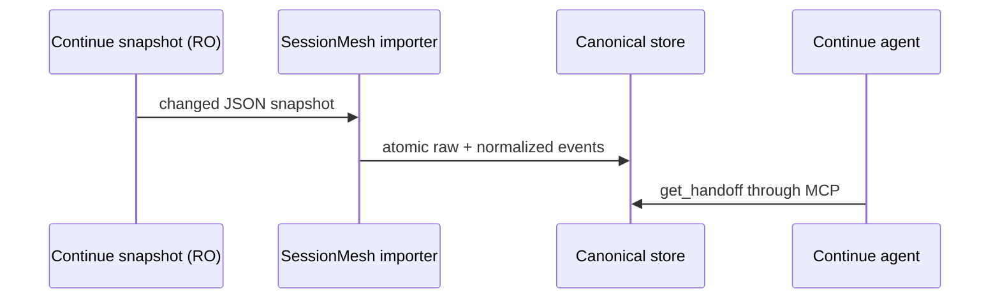

# Continue adapter

SessionMesh discovers Continue session snapshots in
`~/.continue/sessions/*.json`. The aggregate `sessions.json` index is excluded
because individual snapshots provide the auditable event source.

## Normalization and chronology

- User, assistant, and system messages become canonical message events.
- Native session IDs are namespaced with `continue:`.
- Native timestamps are preferred. When a record has no timestamp, the source
  modification time anchors the snapshot and native sequence preserves order.
- Workspace fields are normalized for cross-tool correlation.
- Rewritten snapshots are safely reprocessed; deterministic event IDs keep the
  import idempotent.

Continue receives the resulting context through its MCP server configuration
and startup rule. SessionMesh does not write to Continue's session history.

