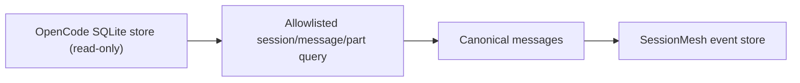

# OpenCode

SessionMesh imports OpenCode sessions from the local SQLite store without
modifying it. Discovery uses:

```text
~/.local/share/opencode/opencode.db
```



Only the `session`, `message`, and `part` tables are queried. Account,
credential, sharing, and other unrelated tables are deliberately excluded.
Text parts retain their native session identity, role, timestamp, workspace,
and source-row provenance. The adapter observes both the database and WAL
state so newly checkpointed messages are discovered by later scans. It opens
the database in SQLite immutable mode because the agent-home mount is
read-only; uncheckpointed WAL frames remain owned by OpenCode and become
visible after its next checkpoint without SessionMesh writing lock state.

The mounted agent home must be readable by the service user. In OCI mode it is
available below `/sources/home`; the native path remains in provenance.
