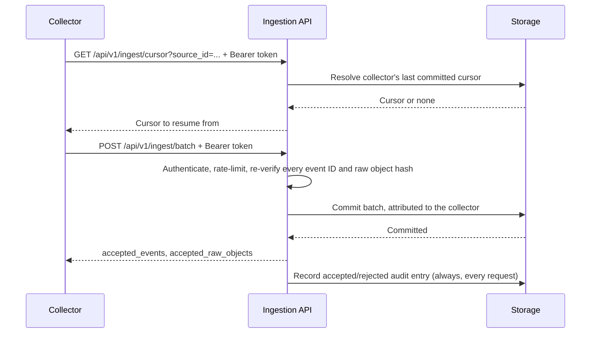

# Network Ingestion API

SessionMesh exposes a second, separate API for remote
[collectors](../architecture/deployment.md#multi-host-collector-setup) —
dedicated systems it cannot mount a local filesystem from. It is served on
its own TLS-terminated listener and port (`ingest_bind_address:ingest_port`),
independent from the [local loopback API](rest.md), and is only mounted when
`network_ingestion_enabled = true`. See
[Configuration](../development/configuration.md#network-ingestion-remote-collectors)
for the full field reference.



## Authentication

Send a collector's bearer token, issued with
`sessionmesh collector issue <label>`:

```bash
curl \
  --cacert /path/to/ingest-ca.pem \
  -H "Authorization: Bearer ${SESSIONMESH_COLLECTOR_TOKEN}" \
  "https://sessionmesh.internal:8788/api/v1/ingest/cursor?source_id=codex%3Arollout"
```

This token is distinct from the local UI/MCP token and authorizes only these
two endpoints. It is revocable independently of any other collector with
`sessionmesh collector revoke <collector-id>`; a revoked token stops
authenticating immediately.

## Endpoints

| Method | Path                     | Purpose                                          |
| ------ | ------------------------ | ------------------------------------------------- |
| GET    | `/api/v1/ingest/cursor`  | Resolve the caller's last committed cursor for one source |
| POST   | `/api/v1/ingest/batch`   | Commit raw objects, canonical events, and the resulting cursor |

Both endpoints require the `source_id` query parameter (`GET`) or body field
(`POST`) — a collector-chosen identity for one native source, e.g.
`codex:/home/agent/.codex/sessions/.../rollout.jsonl`. The daemon scopes it
internally to `collector:<collector-id>:<source_id>` before touching storage,
so two collectors can never observe or overwrite one another's cursor, even
if they report the identical local path.

### `GET /api/v1/ingest/cursor`

```json
{
  "cursor": {
    "source_generation": "generation-1",
    "byte_offset": 4096,
    "next_sequence": 12,
    "partial_line_base64": "",
    "updated_at": "2026-07-20T14:30:05Z"
  }
}
```

`cursor` is `null` when the collector has never successfully committed a
batch for that source — the collector then starts from the beginning.

### `POST /api/v1/ingest/batch`

```json
{
  "source_id": "codex:/home/agent/.codex/sessions/2026/07/20/rollout.jsonl",
  "raw_objects": [
    {
      "id": "sha256:...",
      "bytes_base64": "...",
      "source_path": "/home/agent/.codex/sessions/2026/07/20/rollout.jsonl",
      "original_path": null,
      "source_offset": 0,
      "source_size": 4096,
      "source_modified_at": null,
      "source_permissions": null,
      "source_generation": "generation-1",
      "parser_version": "0.1.0",
      "imported_at": "2026-07-20T14:30:00Z"
    }
  ],
  "events": ["{\"schema_version\":\"1.0\",\"event_id\":\"sha256:...\", ...}"],
  "cursor": {
    "source_generation": "generation-1",
    "byte_offset": 4096,
    "next_sequence": 12,
    "partial_line_base64": "",
    "updated_at": "2026-07-20T14:30:05Z"
  }
}
```

Each entry in `events` is one canonical event as compact JSON, exactly as
produced by the collector's own event construction — the same code path the
daemon uses for local ingestion. The daemon re-validates every entry, which
recomputes and checks its deterministic event ID from content; a collector
cannot commit an event under a fabricated ID. It likewise recomputes each raw
object's content hash from `bytes_base64` and rejects the whole batch if it
does not match the declared `id`. A batch commits atomically: either every
event and raw object in it lands, or none do.

On success:

```json
{ "accepted_events": 1, "accepted_raw_objects": 1 }
```

## Limits and errors

| Condition                          | Status | `code`                        |
| ----------------------------------- | ------ | ------------------------------ |
| Missing or invalid/revoked token   | 401    | `unauthorized`                 |
| Over the per-collector rate limit  | 429    | `rate_limited`                 |
| Batch exceeds `ingest_max_batch_bytes` | 413 | `payload_too_large`            |
| Batch exceeds `ingest_max_events_per_batch` | 413 | `too_many_events`         |
| Malformed request body             | 400    | `malformed_request`            |
| An event fails ID re-verification  | 400    | `invalid_event`                |
| A raw object's declared `id` does not match its content | 400 | `raw_object_identity_mismatch` |
| Commit failed internally           | 500    | `internal_error` (no internal detail is returned to the client) |

```json
{ "code": "rate_limited", "message": "collector exceeded its request rate limit" }
```

Every request — accepted or rejected, including authentication failures —
is written to an ingestion audit log, attributing it to the resolved
collector when authentication succeeded, and to no collector when it did
not. See [Storage Architecture](../architecture/storage.md) for the
underlying tables.
