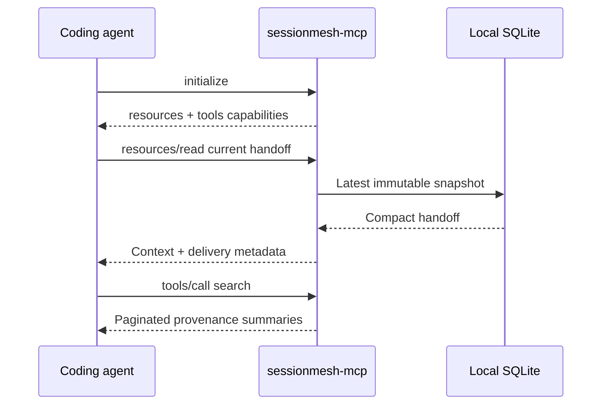

# MCP integration

SessionMesh implements the MCP `2025-06-18` stdio lifecycle, resources, and
tools using newline-delimited JSON-RPC 2.0. Stdio is deliberate: the MCP host
launches the local process, while remote HTTP authorization remains outside the
MVP.

The protocol structure follows the official
[MCP base protocol](https://modelcontextprotocol.io/specification/2025-06-18/basic/index),
[resource model](https://modelcontextprotocol.io/specification/2025-06-18/server/resources),
and [tool model](https://modelcontextprotocol.io/specification/2025-06-18/server/tools).



## Resources

| URI                             | Content                         |
| ------------------------------- | ------------------------------- |
| `sessionmesh://current`         | Current global context and refs |
| `sessionmesh://handoff/current` | Compact latest handoff          |

Handoff delivery metadata contains origin, schema version, snapshot ID,
generation time, staleness, and `ingestion_excluded: true`. Consumers can
therefore avoid importing SessionMesh-derived content as a native source.

## Tools

| Tool                          | Effect                                 |
| ----------------------------- | -------------------------------------- |
| `sessionmesh_get_current`     | Read current context                   |
| `sessionmesh_get_handoff`     | Read compact handoff                   |
| `sessionmesh_search`          | Fetch event provenance on demand       |
| `sessionmesh_record_decision` | Record typed user-observation decision |
| `sessionmesh_record_task`     | Record typed user-observation task     |

Every input schema rejects additional properties. Search is limited to 100
items and uses opaque `v1:search:` cursors. Duplicate write `request_id`
values are idempotent; reusing an ID with different data fails.

Recorded content is classified as `user_observation` with
`instruction: false`. Prompt-like or injection-like text remains untrusted
data and never enters a system-instruction channel.

## Write authorization

Reads are enabled for a process launched in the user's local context. Writes
are denied unless the trusted MCP host explicitly sets:

```text
SESSIONMESH_MCP_ALLOW_WRITES=true
```

This is process-scoped stdio authorization, consistent with the MCP rule that
stdio credentials come from the environment rather than the HTTP OAuth flow.
All records retain origin and an idempotency key.

## Codex installation

Build the binary:

```bash
cargo build --release --package sessionmesh-mcp
```

Add a narrowly scoped server to the Codex MCP configuration. Substitute
absolute paths and enable writes only when wanted:

```toml
[mcp_servers.sessionmesh]
command = "/absolute/path/to/sessionmesh-mcp"

[mcp_servers.sessionmesh.env]
SESSIONMESH_HOME = "/home/user/.local/share/sessionmesh"
SESSIONMESH_PROJECT_ROOT = "/absolute/path/to/project"
SESSIONMESH_MCP_ALLOW_WRITES = "false"
```

SessionMesh does not rewrite unrelated Codex settings. The project marker
provides automatic current-context discovery at the beginning of a fresh
session; the agent initially reads the compact resource and loads details only
through search.
