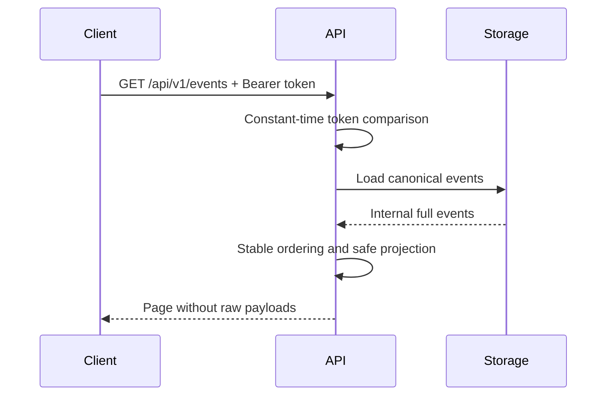

# Local REST and SSE API

SessionMesh exposes a versioned loopback API. `/api/v1/health` is public for
native and OCI health checks. Every data or state-changing endpoint requires a
local bearer token.



## Authentication

Send the locally provisioned token:

```bash
curl \
  -H "Authorization: Bearer ${SESSIONMESH_LOCAL_TOKEN}" \
  http://127.0.0.1:8787/api/v1/tools
```

The token is runtime state and must never be committed or placed in
`.env.example`. Authentication failures return a stable JSON envelope and do
not reveal whether a resource exists.

## Milestone 1 endpoints

| Method | Path                           | Purpose                                |
| ------ | ------------------------------ | -------------------------------------- |
| GET    | `/api/v1/health`               | Service and API version                |
| GET    | `/api/v1/tools`                | Safe tool discovery status             |
| POST   | `/api/v1/tools/discover`       | Request discovery refresh              |
| GET    | `/api/v1/native-sessions`      | Paginated native-session summaries     |
| GET    | `/api/v1/native-sessions/{id}` | One native-session summary             |
| GET    | `/api/v1/events`               | Paginated payload-free event summaries |
| GET    | `/api/v1/events/{id}`          | Explicit canonical event detail reveal |
| GET    | `/api/v1/events/stream`        | Resumable live summaries over SSE      |
| GET    | `/api/v1/global-sessions`      | Global work contexts                   |
| POST   | `/api/v1/global-sessions`      | Create a global work context           |
| GET    | `/api/v1/global-sessions/{id}` | Membership and audit detail            |

Membership link/unlink endpoints and correlation accept/reject operations are
authenticated writes. They store native-session references only, and every
manual decision is audited. A rejection returns `409 conflict` on a later
silent relink until explicitly reversed.

| Method | Path                                 | Purpose                      |
| ------ | ------------------------------------ | ---------------------------- |
| GET    | `/api/v1/handoffs/{globalSessionId}` | Latest immutable handoff     |
| POST   | `/api/v1/handoffs/{globalSessionId}` | Generate and store a handoff |

## Pagination and filters

List endpoints accept `limit` from 1 to 200 and an opaque `v1` cursor. Invalid,
unknown, or wrong-scope cursors return `400 invalid_cursor`.

Native-session filters:

```text
tool_family=codex
```

Event filters:

```text
native_session_id=session-019
kind=tool_call
```

Sessions use stable native identity order. Events use normalized timestamp,
native sequence, source generation, byte offset, durable ingestion sequence,
and event ID. Equal timestamps and late arrivals therefore remain
deterministic.

## Response safety

Session and event list responses deliberately exclude canonical payloads, raw
objects, prompts, tool output, and sensitive-field values. They expose only
identity, chronology, kind, CWD, branch, and lifecycle metadata.

The authenticated event-detail endpoint includes the canonical payload and
provenance. It exists for an explicit UI reveal only and must not be fetched
speculatively. Native raw bytes remain in the immutable store and are not
returned by this endpoint.

Errors use:

```json
{
  "code": "invalid_cursor",
  "message": "the pagination or resume cursor is invalid"
}
```

Internal database and parser failures are logged by the service boundary but
return only `internal_error`; native content is never copied into HTTP errors.

## SSE recovery and backpressure

Every SSE item uses the deterministic canonical event ID:

```text
id: sha256:...
event: canonical_event
data: {"event_id":"sha256:...","native_session_id":"..."}
```

Clients reconnect with `Last-Event-ID`. Persisted events after that ID are sent
before live delivery, so daemon restarts do not create an event gap. Unknown
resume IDs are rejected instead of silently replaying an ambiguous stream.

The live broadcast buffer is bounded to 128 summaries. A lagging client is
disconnected and resumes from its last acknowledged ID rather than causing
unbounded memory growth.
