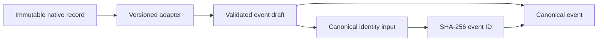

# Canonical Events

Canonical events provide a versioned, tool-independent representation while
retaining every native source coordinate needed for audit and reprocessing.

## Version and kinds

Version `1.0` supports user, assistant, and system messages; tool calls and
results; file activity; patches; commands; Git state; plans; tasks; decisions;
checkpoints; compaction; errors; subagent creation; and session lifecycle.

Unsupported native kinds become `unknown` events. Their native kind and payload
remain data and are never discarded or promoted into instructions.

## Deterministic identity

The event ID is `sha256:` followed by the lowercase SHA-256 digest of canonical
JSON containing:

- schema version;
- tool family, surface, and profile;
- native session ID and sequence;
- original timestamp and precision;
- canonical kind;
- workspace context;
- lexically ordered payload;
- source generation; and
- source offset.

The identity intentionally excludes:

- collector-readable and original display paths;
- adapter version;
- ingestion sequence; and
- ordering confidence.

Those fields may change when the same source is mounted in a container,
reprocessed by a newer adapter, or imported in a different run. Excluding them
keeps semantic identity stable. A semantic payload, workspace, timestamp,
sequence, generation, or offset change creates a different ID.

## Validation

Construction rejects empty identity fields, malformed RFC 3339 timestamps,
out-of-range ordering confidence, unsupported schema versions, malformed IDs,
and IDs that do not match recomputed identity.

The source timestamp is preserved exactly rather than reformatted. Its
precision is explicit so later chronology can distinguish a precise observation
from a coarse or unknown one.

## Schema parity

The Rust types and `schemas/canonical-event.schema.json` share the version,
required fields, event-kind vocabulary, timestamp precision, workspace shape,
and provenance constraints. The published valid example is parsed by Rust and
its deterministic ID is recomputed in the test suite; the same example is also
validated against JSON Schema.
