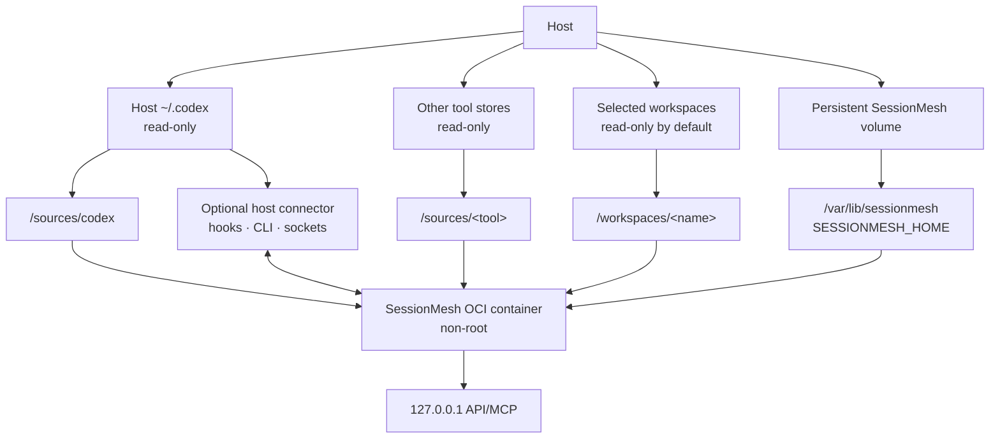

# Deployment Model


SessionMesh has one configuration and storage model across native, Docker, and
Podman deployments.

For sources that need host-only CLI, hook, or socket access, a small native host
connector forwards versioned events and receives derived handoffs from the
containerized core. The connector does not own canonical state.

## Runtime layout



## Native service

Native installations use the platform's user-data directory by default and
allow an explicit `SESSIONMESH_HOME`. The daemon, CLI, and future desktop shell
must resolve the same effective configuration. Native agent sources are opened
read-only even when ordinary filesystem permissions would allow writes.

## OCI service

The same OCI image runs under Docker and Podman:

- `SESSIONMESH_HOME` is `/var/lib/sessionmesh`;
- `/var/lib/sessionmesh` is a persistent named volume or bind mount;
- each agent source has an explicit read-only mount below `/sources/<tool>`;
- repositories use explicit mounts below `/workspaces/<name>`;
- the process runs as a non-root user;
- the API is published on the host loopback interface by default; and
- the health endpoint drives container health checks.

Container-local paths and original host paths are different concepts.
Configuration records the original-path label separately so provenance remains
meaningful without pretending the container can access the host path directly.

The Compose service binds the daemon to the container network interface and
publishes it exclusively as `127.0.0.1:8787` on the host. Remote model
endpoints remain absent unless configured separately, and Compose does not
publish a non-loopback host port. Native execution retains the direct
`127.0.0.1` default.

The daemon provisions `$SESSIONMESH_HOME/api-token` atomically with `0600`
permissions. The token remains inside persistent runtime state and is never an
image layer, Compose environment value, or repository template.

The Compose service sets container-local `CODEX_HOME=/sources/codex`. The
daemon repeatedly performs read-only discovery and cursor-based incremental
scans at `SESSIONMESH_WATCH_DEBOUNCE_MS`. Only complete records commit; each
new canonical event is then published to SSE clients. This makes synchronization
automatic for the coding agent without modifying or requiring participation
from the native tool.

## Example contract

The exact image name and port are finalized during bootstrap, but the mount
contract is:

```yaml
services:
  sessionmesh:
    image: sessionmesh:local
    environment:
      SESSIONMESH_HOME: /var/lib/sessionmesh
    volumes:
      - sessionmesh-data:/var/lib/sessionmesh
      - ${HOME}/.codex:/sources/codex:ro
    ports:
      - "127.0.0.1:8787:8787"

volumes:
  sessionmesh-data:
```

Podman uses the same definition. On SELinux hosts, bind mounts require an
appropriate relabeling option such as `:z` or a pre-labeled directory; the
source must remain read-only.

During the workspace-bootstrap stage, the image validates compilation,
non-root ownership, persistent-home access, and source-mount protection. The
long-running health endpoint is introduced with the versioned API rather than
as a temporary bootstrap server.

## Security invariants

- A missing source mount is a visible configuration or health condition, not a
  reason to scan the container home.
- SessionMesh never changes permissions on native source mounts.
- Root containers are not a supported default.
- Secrets enter the container only through explicit configuration mechanisms.
- Remote network binding and remote model access remain opt-in.
- Backup and restore operate on SessionMesh state, never on native tool stores.
