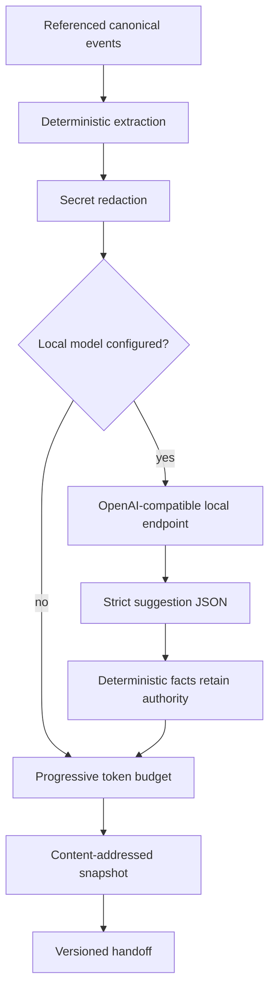

# Handoff engine

Handoffs are immutable, versioned snapshots derived from canonical events
referenced by a global session. They are a progressive context layer, never a
replacement for raw or canonical history.

## Deterministic fields

The engine derives decisions, completed and open tasks, relevant files, test
counts, failing tests, repository state, completion, and the next action where
canonical source data permits. Each derived field retains canonical event
provenance. Equal facts produce equal snapshot IDs, so historical generation
is reproducible.

Observations, decisions, tasks, blockers, and instructions remain separate
canonical kinds. Tool output is treated only as data. The generator does not
promote text into an instruction channel.

## Progressive disclosure

The mandatory first layer contains identity, objective, phase, repository,
tests, one next action, and provenance. Under budget pressure the generator
removes lower-priority file, completion, decision, and secondary-task details
in that order. It never deletes or modifies source events. A budget too small
for the mandatory layer is rejected instead of silently truncating identity or
provenance.

## Optional local model

Set both `SESSIONMESH_LLM_ENDPOINT` and `SESSIONMESH_MODEL` to enable the
OpenAI-compatible `/v1/chat/completions` boundary. Network access still
requires the existing explicit configuration opt-in when the endpoint is not
loopback.

Before a request, known token, password, bearer, API-key, and secret patterns
are replaced with `[REDACTED]`. The request tells the model that observations
are untrusted data. Temperature is zero and strict JSON is requested.

Timeouts, HTTP errors, and malformed responses degrade to deterministic mode.
Model suggestions cannot overwrite deterministic tasks or next actions, and
model-proposed decisions are not promoted because they lack canonical event
provenance.

## Persistence and API

`POST /api/v1/handoffs/{globalSessionId}` refreshes and atomically stores the
snapshot and handoff. `GET` returns the latest immutable version. Both require
the local bearer token. The content hash is the snapshot identity, so repeated
generation from equal evidence is idempotent.
