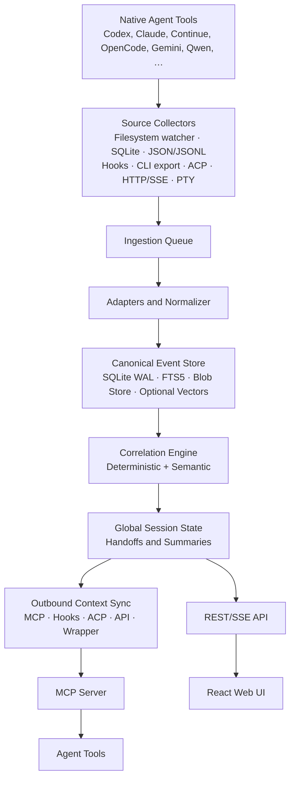

# Architecture and Implementation Plan: Agent Session Mesh

## 1. Target state

**Working title:** SessionMesh

SessionMesh is a local, tool-independent session and context layer for coding
agents. The system will:

- discover native sessions from different agent tools;
- import them unchanged and traceably;
- link related sessions into a global work session;
- produce a compact and current handoff state;
- deliver that state to other agents through MCP, hooks, CLI, or files;
- expose and configure all operations in a local web interface; and
- onboard new or unknown tools through custom profiles.

The terminology is important:

> Native sessions are not destructively merged. A global session references,
> correlates, and evaluates them together.

Original data therefore remains intact, and every tool can continue its own
session natively.

## 2. Relevant agent tools

### First integration priority

#### Continue CLI and Continue IDE

Continue CLI is now named `cn`. It supports `/resume`, `/fork`, `/compact`, and
resuming a session in headless mode. Its default local configuration is
`~/.continue/config.yaml`. CLI and IDE are two surfaces of the same tool
family, but they must not automatically be treated as one session store.

#### GitHub Copilot CLI

GitHub Copilot CLI is especially relevant. It stores session data locally,
including prompts, responses, tool use, and changed files. Its configuration
directory contains per-session `events.jsonl` logs plus workspace artifacts,
plans, and checkpoints. Sessions can be resumed and synchronized with other
Copilot surfaces.

**Priority:** Very high.

#### Gemini CLI

Gemini CLI saves sessions automatically and provides a session browser and
`/resume`. Sessions can be resumed by UUID, index, or `latest`. It also supports
manual checkpoints.

**Priority:** Very high.

#### Cursor CLI

Cursor CLI supports `cursor-agent ls`, `cursor-agent resume`, and
`--resume <chat-id>`. A persistent session store exists, although its internal
path is less clearly documented publicly. The adapter should use the CLI
interface first and add local files later as an optimized source.

**Priority:** High.

#### Cline CLI and Cline IDE

Cline organizes work as tasks. A task includes the conversation, code changes,
commands, and decisions. Its hub-and-spoke architecture is particularly useful:
a local daemon coordinates sessions while CLI, VS Code, and other clients
connect to it. This is substantially more stable than file scraping.

**Priority:** Very high.

#### Kiro CLI and Kiro IDE

Kiro automatically stores all chat turns in a local database under `~/.kiro/`.
Sessions are directory-specific, can be saved or loaded as JSON, and have
UUIDs. ACP session metadata and event logs are explicitly stored as JSON and
JSONL under `~/.kiro/sessions/cli/`.

**Priority:** Very high.

#### Qwen Code

Qwen Code provides native session IDs, `--resume`, and SDK support for resuming
known sessions. Its ACP layer supports `session/new`, `session/load`,
`session/resume`, and `session/list`. This makes it especially suitable for a
local HPC workflow.

**Priority:** Very high.

#### Aider

Aider has a simple, accessible session mechanism. It writes chat histories and
complete LLM histories to files and can resume the latest conversation with
`--restore-chat-history`. The data is less structured than Codex or Copilot
data, but easy to parse.

**Priority:** High.

#### Goose

Goose provides a desktop app, CLI, server API, and ACP. ACP can create, load,
and resume sessions with complete history. Its server API exposes session
endpoints and streaming, so Goose does not require file scraping.

**Priority:** Very high.

### Second integration priority

#### Auggie CLI by Augment

Auggie supports local session histories, `--continue`, `--resume`, JSON session
lists, and session deletion. Its task manager persists state under `~/.augment`.

#### Factory Droid

Droid can list, search, resume, and fork local sessions. The Factory app and CLI
can share session concepts. Cloud synchronization can be disabled so sessions
remain local.

#### OpenHands CLI

OpenHands provides a CLI, web interface, local Agent Server, hooks, and an SDK
with conversations and events. Its local server or hook layer is preferable to
reading internal files directly.

#### Warp Agent

Warp manages agent conversations as sessions and supports history and
conversation forking. It should initially be experimental because local and
synchronized data may not be clearly separated.

### Observation list

The data model must consider, but the first release need not natively support:

- Amp
- Kilo CLI
- Roo Code
- Crush
- Zed Agent Panel
- JetBrains AI Agent
- GLM Agent
- DeepAgents ACP
- experimental ACP agents
- internal enterprise agents
- custom agent harnesses

The custom-profile system is more important than bundled adapters for this
group.

## 3. Architecture principles

### 3.1 Local first

Session content does not leave the computer by default. Cloud services can be
used only when explicitly enabled. Embeddings, classification, and summaries
must support a local HPC environment through an OpenAI-compatible endpoint.

### 3.2 Immutable raw store

Every imported native session is first stored unchanged with:

- original path;
- file hash;
- file size;
- modification time;
- byte offset;
- source tool;
- parser version;
- import time;
- permissions; and
- origin.

A summary never replaces the raw store.

### 3.3 Normalized events

Native data maps into a canonical event model:

- User Message
- Assistant Message
- System Message
- Tool Call
- Tool Result
- File Read
- File Write
- Patch
- Shell Command
- Command Result
- Git State
- Plan
- Task
- Decision
- Checkpoint
- Compaction
- Error
- Subagent Spawn
- Session Start
- Session End

### 3.4 Global sessions as a graph

A global session is not a copied transcript:

```text
GlobalSession
├── Codex native session
├── Claude Code native session
├── Continue native session
├── OpenCode native session
└── Qwen native session
```

Every assignment retains:

- confidence;
- contributing features;
- parser version;
- correlation model; and
- manual confirmation or rejection.

### 3.5 Progressive disclosure

When agents switch, the receiving agent initially gets:

1. objective;
2. current state;
3. decisions;
4. open tasks;
5. relevant files; and
6. latest Git and test state.

Details are loaded through MCP only when needed.

### 3.6 Automatic context synchronization

SessionMesh actively watches configured native sources. Agents do not need to
request import or manually copy context. The service continuously updates its
canonical event log, global-session graph, and handoff state.

The shared state is synchronized outward through documented MCP, hooks, ACP,
local APIs, wrappers, or generated files. SessionMesh does not rewrite native
transcripts. Connector capabilities state whether a tool supports observation,
automatic injection, resume, or only manual handoff delivery.

### 3.7 Deterministic chronology

Original timestamps are preserved but are not sufficient by themselves.
SessionMesh preserves source-local sequence and orders global views using
timestamp, native sequence, source generation, byte offset, ingestion sequence,
and deterministic event ID. Timestamp precision and ordering confidence remain
visible. Explicit causal links are stronger evidence than display order.

## 4. Overall technical architecture



## 5. Technology selection

### Core daemon

**Recommendation:** Rust

Libraries:

- Tokio
- Axum
- SQLx
- Serde
- `notify`
- tracing
- tower
- clap
- schemars
- jsonschema

Benefits include a single binary, low resource use, robust filesystem and
process control, safe concurrency, suitability for a long-running local daemon,
and a direct future path to Tauri.

### Web interface

Use React and TypeScript with:

- Vite
- TanStack Router
- TanStack Query
- TanStack Table
- React Flow for session graphs
- Monaco Editor for custom profiles
- Server-Sent Events for live monitoring

### Persistence

Version one uses:

- SQLite in WAL mode;
- FTS5 for full-text search;
- a content-addressed filesystem store for large tool results; and
- optional `sqlite-vec` or a separate vector store.

PostgreSQL is deferred until a multi-user or server mode exists.

### Runtime and packaging

The daemon must run both natively and as an OCI service under Docker or Podman.
Native installations use platform conventions and may override state location
with `SESSIONMESH_HOME`. The container contract is:

- `SESSIONMESH_HOME=/var/lib/sessionmesh`;
- a persistent state volume mounted at `/var/lib/sessionmesh`;
- native tool sources mounted read-only below `/sources/<tool>`;
- workspace repositories mounted separately when repository inspection is
  enabled;
- a non-root runtime user; and
- identical image and configuration behavior under Docker and Podman.

The container must not infer host paths from its own home directory. Explicit
source mappings translate container paths to preserved host-origin metadata.
When a mounted source cannot provide hooks, local sockets, or CLI integration,
a small native host connector can bridge those capabilities to the
containerized core.

### Local models

Use separate models:

- a small embedding model for similarity;
- a small-to-medium extraction model; and
- Qwen 35B or 70B only for difficult correlations and high-quality handoffs.

## 6. Repository structure

```text
sessionmesh/
├── Cargo.toml
├── rust-toolchain.toml
├── AGENTS.md
├── README.md
├── crates/
│   ├── sessionmesh-core/
│   ├── sessionmesh-storage/
│   ├── sessionmesh-ingest/
│   ├── sessionmesh-correlator/
│   ├── sessionmesh-handoff/
│   ├── sessionmesh-adapter-sdk/
│   ├── sessionmesh-mcp/
│   ├── sessionmesh-acp/
│   ├── sessionmesh-api/
│   ├── sessionmesh-daemon/
│   └── sessionmesh-cli/
├── adapters/
│   ├── codex/
│   ├── claude-code/
│   ├── continue/
│   ├── opencode/
│   ├── gemini/
│   ├── qwen-code/
│   └── custom/
├── apps/
│   └── web/
├── profiles/
│   ├── builtins/
│   └── examples/
├── schemas/
│   ├── canonical-event.schema.json
│   ├── tool-profile.schema.json
│   └── handoff.schema.json
├── migrations/
├── fixtures/
│   ├── codex/
│   ├── claude/
│   └── continue/
├── docs/
│   ├── architecture/
│   ├── adapters/
│   └── adr/
└── scripts/
```

The implemented documentation structure may add MkDocs-specific development,
implementation, and change sections without changing these product modules.

## 7. Canonical data model

### Central tables

```text
tool_families
tool_profiles
tool_installations
source_locations
native_sessions
native_events
raw_objects
repositories
worktrees
global_sessions
global_session_members
correlation_candidates
correlation_evidence
state_snapshots
handoffs
ingestion_cursors
adapter_runs
security_findings
user_overrides
```

### Normalized event example

```json
{
  "schema_version": "1.0",
  "event_id": "sha256:...",
  "tool": {
    "family": "codex",
    "surface": "cli",
    "profile": "default"
  },
  "native_session_id": "019e17c0-...",
  "sequence": 42,
  "timestamp": "2026-07-20T14:31:22.192Z",
  "kind": "tool_result",
  "workspace": {
    "cwd": "/home/user/projects/sessionmesh",
    "repository_id": "repo_...",
    "branch": "main",
    "head": "a218df4"
  },
  "payload": {
    "tool_name": "shell",
    "exit_code": 0,
    "stdout_blob": "sha256:...",
    "stderr_blob": null
  },
  "provenance": {
    "source_path": "~/.codex/sessions/2026/07/20/rollout-....jsonl",
    "source_offset": 17428,
    "adapter_version": "0.1.0"
  }
}
```

Event IDs are deterministic. Rescanning must not create duplicates.

## 8. Adapter system

### Level 1: Declarative profiles

For simple JSON, JSONL, Markdown, or SQLite sources. Supported source types:

- `jsonl`
- `json`
- `sqlite`
- `markdown`
- `directory`
- `command-json`
- `http`
- `sse`
- `acp`
- `manual-export`

### Level 2: Process adapters

An external program communicates through NDJSON:

```text
stdin:
{"method":"discover","params":{...}}

stdout:
{"type":"session","session":{...}}
{"type":"event","event":{...}}
{"type":"cursor","cursor":{...}}
```

Adapters can therefore be developed in Python, TypeScript, Go, or Rust.

### Level 3: Native Rust adapters

Reserve native implementations for important or performance-critical tools:

- Codex
- Claude Code
- GitHub Copilot CLI
- Gemini CLI
- Kiro
- Qwen Code

## 9. Custom profiles

Custom profiles must be fully manageable through the web interface.

### Continue CLI example

```yaml
apiVersion: sessionmesh.dev/v1alpha1
kind: ToolProfile

metadata:
  name: continue-cli
  displayName: Continue CLI
  family: continue
  surface: cli

spec:
  detection:
    executables:
      - cn
    configPaths:
      - ~/.continue/config.yaml

  sources:
    - id: session-store
      type: directory
      paths:
        - ~/.continue
      recursive: true
      include:
        - "**/*.json"
        - "**/*.jsonl"
        - "**/*.db"
        - "**/*.sqlite"

  sessionDiscovery:
    strategy: auto
    fallback:
      type: command-json
      command:
        - cn
        - session
        - list
        - --json

  workspace:
    cwdFields:
      - "$.cwd"
      - "$.workspace"
      - "$.projectPath"

  capabilities:
    resume: true
    fork: true
    compact: true
    mcp: true
    hooks: false

  redaction:
    ruleset: default-secrets

  ingestion:
    mode: watch
    debounceMs: 750
```

### Profile editor

The web editor needs:

- path selection;
- file preview;
- SQLite table preview;
- JSONPath testing;
- regular expressions;
- timestamp mapping;
- session-ID mapping;
- workspace mapping;
- event-type mapping;
- test runs against sample files;
- normalized-event previews;
- secret detection; and
- profile versioning.

Arbitrary scripts are disabled by default. A script adapter requires explicit
approval.

## 10. Session correlation

### Phase 1: Explicit assignment

SessionMesh can optionally create:

```text
.sessionmesh/current.json
```

Example:

```json
{
  "global_session_id": "gs_019...",
  "objective": "Implement canonical Codex event parser",
  "updated_at": "2026-07-20T14:30:00Z"
}
```

The file contains no transcripts or secrets. Another tool starting in the same
project can immediately resolve the assignment.

### Phase 2: Deterministic correlation

Features include:

- repository remote URL;
- repository root;
- worktree;
- branch;
- Git HEAD;
- commit ancestry;
- temporal proximity;
- changed files;
- executed tests;
- shared issue or ticket;
- previous and next agent; and
- explicit handoff ID.

### Phase 3: Semantic correlation

Only ambiguous cases are sent to a local model. For example, one session plans
a migration of the event store to SQLite WAL and another implements the
migrations and event repository. The model does not decide alone; it produces
additional correlation evidence.

### Phase 4: Review queue

The UI displays uncertain candidates, for example a Claude session and Codex
session with a 78% score. The user can link, separate, create a new global
session, merge global-session groupings, or save an assignment rule.

## 11. Handoff model

A handoff contains structured fields:

```yaml
global_session_id: gs_019...
objective: Build the Codex ingestion vertical slice

status:
  phase: implementation
  completion: 45

decisions:
  - SQLite WAL is the initial database
  - Native session stores remain read-only
  - Event IDs are deterministic hashes

completed:
  - Rust workspace initialized
  - Initial migrations created
  - Daemon health endpoint implemented

open_tasks:
  - Parse Codex tool calls
  - Implement incremental file cursor
  - Add session timeline to web UI

repository:
  branch: feature/codex-adapter
  head: a218df4
  dirty: true

tests:
  passed: 43
  failed: 2
  failing:
    - test_partial_jsonl_line
    - test_rollout_rotation

relevant_files:
  - crates/sessionmesh-ingest/src/codex.rs
  - crates/sessionmesh-storage/src/events.rs

next_action: Fix partial JSONL handling before implementing filesystem watch mode
```

### Delivery to agents

Delivery precedence:

1. MCP Resource
2. MCP Tool
3. session-start hook
4. SessionMesh wrapper
5. generated handoff file
6. manual copy

MCP tools:

```text
sessionmesh_get_current
sessionmesh_get_handoff
sessionmesh_search_events
sessionmesh_search_decisions
sessionmesh_record_decision
sessionmesh_record_task
sessionmesh_record_blocker
sessionmesh_link_native_session
sessionmesh_finish_session
```

ACP standardizes communication between coding agents and clients, including
session creation, loading, and resumption. MCP remains the appropriate layer for
memory, search, and controlled write operations.

## 12. Web interface

### Dashboard

- active global work context;
- most recently used tool;
- currently running agents;
- new native sessions;
- import errors;
- unresolved correlations;
- database size;
- raw-store size;
- summary queue; and
- security warnings.

### Tools

For each tool:

- enabled state;
- detected installation;
- version;
- source paths;
- latest scan;
- session count;
- parser version;
- MCP status;
- ACP status;
- hook status; and
- errors.

### Session explorer

Views:

- native sessions;
- global sessions;
- chronological timeline;
- session graph;
- tool calls;
- file changes;
- Git state;
- decisions;
- open tasks; and
- handoff preview.

### Correlation review

- side-by-side candidates;
- shared files;
- shared branch;
- temporal distance;
- semantic similarity;
- score explanation; and
- manual assignment.

### Configuration

- tool paths;
- custom profiles;
- retention;
- redaction;
- database path;
- blob-store path;
- embedding endpoint;
- LLM endpoint;
- model selection;
- token budget;
- correlation thresholds;
- watcher settings;
- network access; and
- backup and export.

## 13. Desktop and IDE integration

### Codex App

The Codex App uses session history and configuration from Codex CLI and IDE.
Codex is therefore one tool family with several surfaces. The canonical rollout
store is under `$CODEX_HOME/sessions`, typically `~/.codex/sessions/...`.

Initial adapter sources:

```text
~/.codex/sessions/YYYY/MM/DD/rollout-*.jsonl
~/.codex/session_index.jsonl
```

Additional desktop databases may be read-only optional metadata sources.

### Claude Code Desktop

Claude Code stores CLI sessions locally, but CLI, desktop, and the VS Code
extension maintain separate histories. Model them as separate surfaces and
combine them only through correlation.

### General Claude Desktop

General Claude Desktop has an official data export but no documented live feed
for full transcripts. Therefore use MCP to read and write SessionMesh context,
a manual export importer for historical chats, and no direct scraping of
internal Electron databases in the stable core.

### Cline

Integrate Cline through its local hub, not primarily through file scraping.

### Goose

Integrate Goose directly through ACP or its local server API.

### Kiro and Qwen

Both provide ACP-adjacent session interfaces and are strong protocol-connector
candidates.

## 14. REST and streaming API

```text
GET    /api/v1/health
GET    /api/v1/tools
POST   /api/v1/tools/discover
GET    /api/v1/profiles
POST   /api/v1/profiles
PUT    /api/v1/profiles/{id}
POST   /api/v1/profiles/{id}/test

GET    /api/v1/native-sessions
GET    /api/v1/native-sessions/{id}
GET    /api/v1/global-sessions
POST   /api/v1/global-sessions
GET    /api/v1/global-sessions/{id}

GET    /api/v1/correlation-candidates
POST   /api/v1/correlations/accept
POST   /api/v1/correlations/reject

GET    /api/v1/handoffs/{globalSessionId}
POST   /api/v1/handoffs/{globalSessionId}/refresh

GET    /api/v1/events/stream
```

Use Server-Sent Events for initial live data. Add WebSockets only for
bidirectional features.

## 15. CLI

```text
sessionmesh init
sessionmesh daemon
sessionmesh status
sessionmesh doctor

sessionmesh tools discover
sessionmesh tools list
sessionmesh tools enable codex
sessionmesh tools disable codex

sessionmesh profile add
sessionmesh profile test continue-cli
sessionmesh profile import profile.yaml

sessionmesh scan
sessionmesh scan --tool codex
sessionmesh watch

sessionmesh sessions list
sessionmesh sessions show <id>
sessionmesh sessions link <a> <b>
sessionmesh sessions unlink <id>

sessionmesh handoff
sessionmesh handoff --tool codex
sessionmesh handoff --format markdown

sessionmesh mcp install codex
sessionmesh mcp install claude
sessionmesh mcp install continue
```

Wrapper commands:

```text
sessionmesh run codex
sessionmesh run claude
sessionmesh run cn
```

The wrapper sets the global session ID and can inject a handoff at startup.

## 16. Security model

Agent logs may contain prompts, file content, command output, tokens, and
secrets. Claude Code stores local transcripts in plaintext, and Codex rollouts
can contain complete tool input and output.

Therefore:

- open native stores read-only;
- create the SessionMesh database with `0600` permissions;
- bind HTTP to `127.0.0.1` by default;
- use CSRF protection and a local authentication token;
- redact secrets before embeddings and LLM summaries;
- optionally encrypt raw data;
- strictly type MCP write operations;
- store observations, decisions, and instructions separately;
- never turn tool-output content into system instructions automatically;
- run adapter processes with restricted privileges;
- require explicit approval for arbitrary custom scripts;
- audit manual session links; and
- prevent ingestion loops by excluding SessionMesh-generated handoffs from
  native sources.

## 17. Implementation order

### Milestone 0: Foundation

Deliver:

- Rust workspace;
- React application;
- SQLite migrations;
- logging;
- configuration system;
- JSON Schemas;
- ADRs; and
- fixture system.
- native development service configuration;
- OCI image build for Docker and Podman; and
- documented persistent-state and read-only source mounts.

Required ADRs:

```text
ADR-001 Native stores are read-only
ADR-002 Global sessions use references, not transcript copying
ADR-003 SQLite is the initial database
ADR-004 All normalized events retain provenance
ADR-005 LLM correlation is a fallback, not source of truth
ADR-006 MCP is the primary agent integration layer
ADR-007 Custom adapters use a versioned protocol
ADR-008 Synchronize derived context, not native transcripts
ADR-009 Chronology uses multiple ordering signals
```

### Milestone 1: Codex vertical slice

Codex is the first end-to-end adapter:

1. detect `$CODEX_HOME` and `~/.codex`;
2. find `rollout-*.jsonl`;
3. incrementally read sessions;
4. tolerate an incomplete final JSONL line;
5. detect rotations and moves;
6. store raw events;
7. normalize messages and tool calls;
8. extract repository and CWD;
9. expose sessions through REST; and
10. show a session timeline in the web UI.

Definition of done:

- repeated scans create no duplicates;
- a growing rollout file is read only after the previous offset;
- parser errors do not block the whole session;
- raw and normalized events are mutually traceable; and
- a Codex session appears in the browser within seconds.

### Milestone 2: Global sessions and MCP

- repository identity;
- `.sessionmesh/current.json`;
- deterministic correlation;
- global sessions;
- handoff snapshots;
- MCP server;
- Codex MCP configuration; and
- manual assignment in the web UI.

### Milestone 3: Claude Code, Continue, and OpenCode

- Claude JSONL adapter;
- Continue CLI profile;
- Continue IDE profile;
- OpenCode adapter;
- shared project correlation; and
- tool-specific handoff formatting.

### Milestone 4: Gemini, Qwen, Copilot, and Kiro

These structured session sources stabilize the canonical model.

### Milestone 5: Custom Profile Designer

- browser profiles;
- path preview;
- JSONPath;
- SQLite queries;
- regex mapping;
- parser testing;
- fixture export; and
- profile packaging.

### Milestone 6: ACP and hub integrations

- Goose ACP;
- Kiro ACP;
- Qwen ACP;
- Cline Hub;
- OpenHands Server; and
- optional SessionMesh ACP gateway.

### Milestone 7: Desktop and packaging

- Tauri shell;
- autostart;
- tray icon;
- systemd user service;
- launchd;
- Windows service or startup task;
- backup and restore; and
- signed releases.

## 18. Initial Codex implementation tickets

### Ticket 1: Workspace bootstrap

- Create Cargo workspace.
- Configure Rust formatting, Clippy, and tests.
- Create React app.
- Create shared development scripts.
- Add native service entrypoints and an OCI container foundation shared by
  Docker and Podman.

### Ticket 2: Configuration

- Implement Default → User → Environment → CLI precedence.
- Expand `~` and variables in paths.
- Add schema and validation.

### Ticket 3: Storage schema

- Add first migration.
- Add repository traits.
- Enable SQLite WAL.
- Add transaction tests.
- Add test database.

### Ticket 4: Canonical event types

- Rust enums.
- Serde schema.
- JSON Schema.
- Versioning.
- Round-trip tests.

### Ticket 5: Adapter contract

- Discovery.
- Scan.
- Incremental scan.
- Cursor.
- Health.
- Capabilities.

### Ticket 6: Codex discovery

- `$CODEX_HOME`.
- Default paths.
- Rollout discovery.
- Session index.
- Installation detection.

### Ticket 7: Codex parser

- Session metadata.
- User messages.
- Assistant messages.
- Tool calls.
- Tool results.
- Git/CWD.
- Compaction events.
- Unknown event types.

### Ticket 8: Incremental watcher

- File watch.
- Debounce.
- Offset tracking.
- Partial-line buffer.
- Rename handling.
- Retry policy.

### Ticket 9: REST API

- Health.
- Tools.
- Native sessions.
- Events.
- Pagination.
- Filtering.

### Ticket 10: Web timeline

- Session list.
- Event timeline.
- Tool-call details.
- Raw-event view.
- Filtering.
- Live update.

### Ticket 11: Repository identity

- Git root.
- Remote URL.
- Branch.
- Worktree.
- HEAD.
- Dirty state.

### Ticket 12: Global session

- Create.
- Link.
- Unlink.
- Correlation evidence.
- Review UI.

### Ticket 13: MCP server

- `get_current`.
- `get_handoff`.
- `search`.
- `record_decision`.
- `record_task`.

### Ticket 14: Handoff generator

- Deterministic facts.
- Structured state extraction.
- Local LLM.
- Token budget.
- Provenance.

## 19. Explicit first-release exclusions

Do not initially implement:

- lossless conversion of one native session into another tool's resume format;
- a central proprietary agent runner;
- team or multi-user operation;
- cloud synchronization;
- a mobile application;
- a distributed database;
- autonomous conflict resolution;
- automatic modification of native session files; or
- complete long-term memory without provenance.

These capabilities would unnecessarily delay the MVP and may violate native
tool internals.

## 20. Product recommendation

Do not design this project as a “session scraper.”

> SessionMesh is a local observability, correlation, and handoff layer for
> heterogeneous coding agents.

The first release should reliably:

1. import Codex sessions incrementally;
2. normalize native events traceably;
3. manage cross-tool global sessions; and
4. deliver compact handoffs through MCP.

Continue.dev, GitHub Copilot CLI, Gemini CLI, Cline, Kiro, Qwen Code, and Goose
must be represented in the model from the beginning. Native implementations
follow only after the Codex vertical slice, web interface, correlation, and MCP
are stable.
