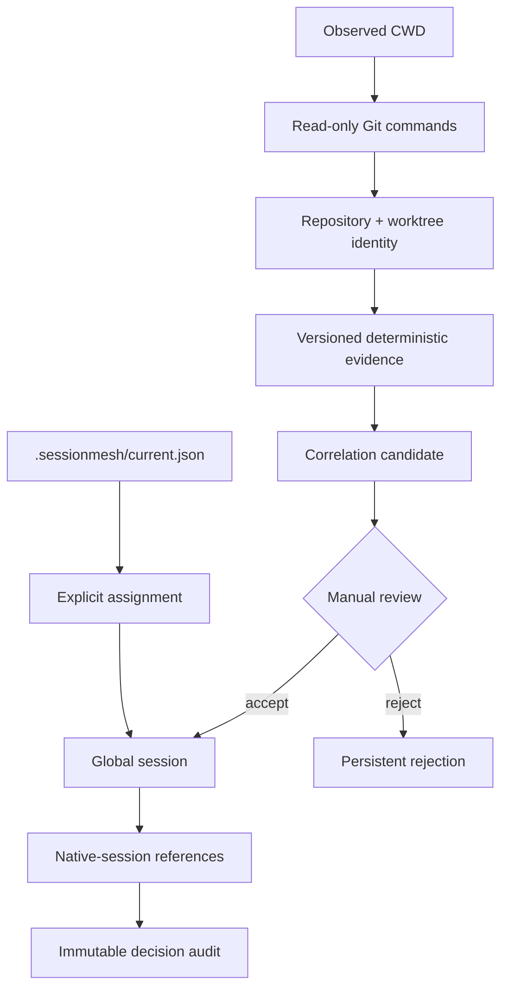
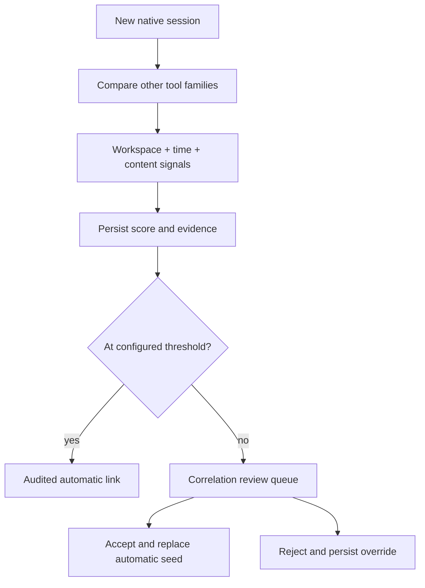

# Repository identity and correlation

SessionMesh identifies project context through read-only Git inspection and
links native sessions by reference. It never copies a transcript into a global
session.



## Identity

The correlator captures:

- canonical repository root and worktree;
- shared Git directory for linked worktrees;
- a normalized origin remote when one exists;
- branch, or an explicit detached-HEAD state;
- HEAD commit and bidirectional ancestry evidence; and
- dirty state including untracked files.

Equivalent scp-like SSH and HTTPS remotes normalize to a host/path identity.
Repositories without remotes use their canonical shared Git directory as the
local identity seed. Inspection uses only `git rev-parse`, `git config --get`,
`git status --porcelain`, and `git merge-base --is-ancestor`; none modifies
the index, configuration, worktree, or refs.

## Explicit project context

`.sessionmesh/current.json` contains exactly:

```json
{
  "global_session_id": "gs_019...",
  "objective": "Build deterministic repository correlation",
  "updated_at": "2026-07-20T14:30:00Z"
}
```

The strict parser rejects unknown fields, malformed timestamps, missing
objectives, and invalid global IDs. Writes use a same-directory temporary file,
`fsync`, and atomic rename. The file must never contain prompts, transcripts,
tokens, or credentials.

## Cross-tool content correlation

New native sessions are compared only with sessions from another tool family.
Algorithm `content-correlation-v1` combines safe, explainable signals:

| Signal                                           | Contribution |
| ------------------------------------------------ | -----------: |
| Same normalized workspace                        |         0.65 |
| Within seven days                                |         0.15 |
| Lexical content similarity in the same workspace |   up to 0.20 |
| Lexical content similarity across workspaces     |   up to 0.85 |

Content similarity is deterministic Jaccard overlap over normalized terms. It
does not send prompts to a model or remote service. Each candidate persists its
workspace, temporal, and content evidence as structured JSON. Scores at or
above the configured threshold are linked automatically; lower non-zero scores
remain in the review queue. Accepted decisions replace only an isolated
automatic seed, while manual memberships are preserved. Rejections persist and
block silent relinking.



## Repository score

Algorithm `deterministic-v1` retains every feature, match result, weight, and
safe explanation:

| Feature            | Weight |
| ------------------ | -----: |
| Repository         |   0.45 |
| Worktree           |   0.15 |
| Branch             |   0.15 |
| HEAD ancestry      |   0.15 |
| Temporal proximity |   0.10 |

The score is evidence, not authority. A manual rejection is persisted as a
user override and prevents silent relinking until an explicit reversal.
Linking, unlinking, rejection, and reversal are transactional and recorded in
an append-only audit log.
