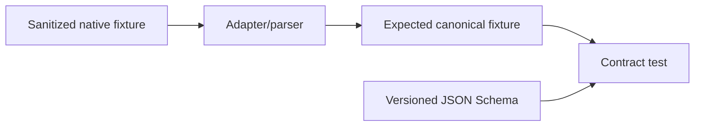
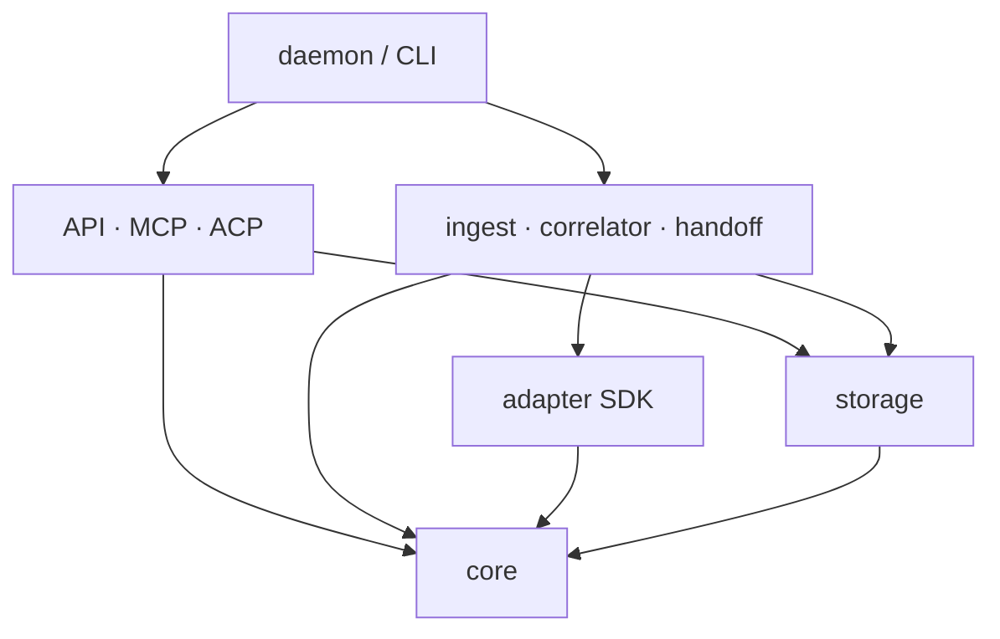

# Schemas and Fixtures

SessionMesh publishes JSON Schema Draft 2020-12 contracts for canonical events,
tool profiles, and handoffs. Schema IDs and payload version fields are stable
compatibility boundaries.

## Compatibility policy

- A schema version describes one accepted wire shape.
- Unsupported versions fail with an actionable error; they never silently
  downgrade.
- Unknown native event kinds are represented by the canonical `unknown` kind
  with their native payload retained.
- Additive compatibility is intentional and tested. Schema fields are not added
  accidentally through permissive object validation.
- Rust domain types and generated or maintained schemas must be checked for
  equivalence when Prompt 03 introduces the canonical model.

## Fixture convention

Fixtures are sanitized, reviewable, and free of real credentials or personal
data. A tool fixture package contains:

- native source bytes;
- a manifest describing tool, surface, source format, and expected parser
  version;
- expected raw-object metadata;
- expected normalized events;
- explicit expected diagnostics; and
- edge-case labels such as partial line, rotation, unknown event, or malformed
  record.

Never alter a fixture merely to make a failing implementation pass. Determine
whether the fixture, schema, or implementation violates the documented
contract, then change the responsible layer with a test explaining why.

## Dependency direction

The executable boundary composes components. Domain and storage layers must not
depend on transports or presentation. The bootstrap manifests are checked by an
automated boundary test, which is extended whenever an intentional dependency
is introduced.
