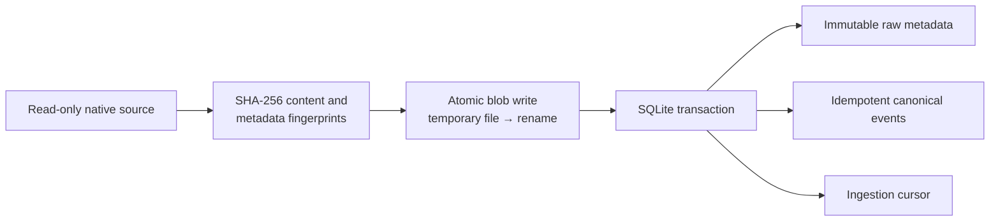

# Storage Architecture

SessionMesh stores imported evidence without modifying native agent stores.
SQLite owns structured metadata and canonical events; a content-addressed
filesystem owns larger raw byte sequences.

## Write path

Blob publication uses a uniquely created temporary file, flushes and
synchronizes its contents, and then renames it to its deterministic address.
Existing content is verified before reuse. SQLite metadata, normalized events,
and the corresponding ingestion cursor commit in one transaction. A failed
batch therefore cannot advertise progress beyond visible events.

## Database behavior

- SQLite runs in WAL mode with foreign keys enabled.
- Connections wait for bounded lock contention instead of failing immediately.
- Database, WAL-related state, and blob content live below the configured
  SessionMesh home.
- The database file and blobs use `0600`; their directories use `0700` on
  Unix.
- FTS5 tables are maintained for later event search.
- Deterministic event IDs make repeated imports idempotent.
- Raw records include content and provenance fingerprints. Reusing an identity
  with different bytes or metadata is rejected as an immutable conflict.

Import-time observations such as current path, source size, modification time,
permissions, and import time are retained from the first successful insert but
are not part of the record's immutable identity. This allows the same native
record to remain idempotent after append, rename, permission change, or replay.
Source generation, byte offset, parser version, and exact bytes define the
stable raw record.

## Retention boundaries

Native stores remain outside SessionMesh retention. Removing SessionMesh state
never removes a native session. Raw objects and normalized events must retain
their provenance together; a future retention policy may delete only explicitly
selected, unreferenced derived data. Handoffs and vector indexes are
reconstructable derivatives and must never replace raw evidence.

## Backup and restore

Do not copy a live SQLite database file without coordinating with SQLite.
Supported backup tooling must use the SQLite backup API or a checkpointed,
consistent snapshot and must include the content-addressed blob directory.
Restore validates migrations and blob hashes before the service resumes
ingestion.

Native source stores are not part of a SessionMesh backup. They remain under
their owning tools' backup policies.

## Migration policy

Migrations are ordered, forward-only, and applied before repositories accept
traffic. A released migration is never edited in place. Schema changes add a
new migration and tests must cover both a fresh database and reopening an
existing database. Destructive migrations require an explicit export,
validation, and recovery design.
