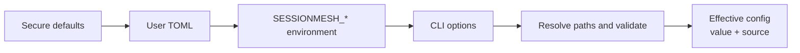

# Configuration

SessionMesh resolves typed configuration in one deterministic order:



A value from a higher layer replaces a lower value. If that higher value is
invalid, startup fails with the field and responsible layer; SessionMesh never
silently falls back.

## Locations

The native user configuration is:

```text
~/.config/sessionmesh/config.toml
```

The native state home defaults to:

```text
~/.local/share/sessionmesh
```

Containers set:

```text
SESSIONMESH_HOME=/var/lib/sessionmesh
```

The database and blob store default to `sessionmesh.db` and `blobs` below the
effective SessionMesh home.

## Security defaults

| Setting                 | Default     | Reason                           |
| ----------------------- | ----------- | -------------------------------- |
| `bind_address`          | `127.0.0.1` | Do not expose local session data |
| `port`                  | `8787`      | Stable local service port        |
| `allow_network`         | `false`     | Require explicit remote opt-in   |
| `redaction_enabled`     | `true`      | Protect derived processing       |
| `watch_debounce_ms`     | `2000`      | Coalesce filesystem event bursts |
| `reconcile_interval_ms` | `30000`     | Bound correlation/handoff cost   |
| `token_budget`          | `4000`      | Bound generated handoffs         |
| `correlation_threshold` | `0.8`       | Avoid weak automatic links       |

`watch_debounce_ms` governs how often the daemon scans for new or changed
native session files; this work is cheap (bounded directory reads plus
offset-based incremental reads). `reconcile_interval_ms` governs the
separate, more expensive pass that re-scores cross-tool correlation and
regenerates handoffs — its cost grows with total accumulated session
history, so it runs on a slower cadence and only when discovery/ingest found
new data since the last pass.

A non-loopback bind address or remote model endpoint requires
`allow_network = true`. Model endpoints accept only HTTP or HTTPS.

## Network ingestion (remote collectors)

| Setting                        | Default    | Reason                              |
| ------------------------------- | ---------- | ------------------------------------ |
| `network_ingestion_enabled`     | `false`    | Disabled unless explicitly opted in  |
| `ingest_bind_address`           | `0.0.0.0`  | Meaningless without remote reach     |
| `ingest_port`                   | `8788`     | Distinct from the local API port     |
| `ingest_tls_cert_path`          | *(none)*   | Required when enabled                |
| `ingest_tls_key_path`           | *(none)*   | Required when enabled                |
| `ingest_max_batch_bytes`        | `10485760` | Bound one collector batch (10 MiB)   |
| `ingest_max_events_per_batch`   | `5000`     | Bound events accepted in one batch   |
| `ingest_rate_limit_per_minute`  | `60`       | Per-collector request budget; `0` disables limiting |

This is a distinct trust boundary from everything else in this document:
every other setting governs the loopback-reachable local API or outbound
model calls, while `network_ingestion_enabled` accepts *inbound* data from
previously unrelated processes — a [collector](../architecture/deployment.md)
running on a dedicated system SessionMesh cannot mount a local filesystem
from. It is served on its own TLS-terminated listener
(`ingest_bind_address:ingest_port`), independent from the local API's
listener, and authenticated per collector with a revocable bearer token
(never the local UI/MCP token). Enabling it requires `allow_network = true`
and both `ingest_tls_cert_path` and `ingest_tls_key_path`; SessionMesh
refuses to start otherwise.

## Environment variables

| Variable                            | Field                       |
| ----------------------------------- | --------------------------- |
| `SESSIONMESH_HOME`                  | State home                  |
| `SESSIONMESH_BIND_ADDRESS`          | API bind address            |
| `SESSIONMESH_PORT`                  | API port                    |
| `SESSIONMESH_ALLOW_NETWORK`         | Network opt-in              |
| `SESSIONMESH_DATABASE_PATH`         | SQLite path                 |
| `SESSIONMESH_BLOB_STORE_PATH`       | Blob-store path             |
| `SESSIONMESH_WATCH_DEBOUNCE_MS`     | Watch debounce              |
| `SESSIONMESH_RECONCILE_INTERVAL_MS` | Reconciliation interval     |
| `SESSIONMESH_REDACTION_ENABLED`     | Redaction toggle            |
| `SESSIONMESH_EMBEDDING_ENDPOINT`    | Embedding endpoint          |
| `SESSIONMESH_LLM_ENDPOINT`          | Extraction/handoff endpoint |
| `SESSIONMESH_MODEL`                 | Model identifier            |
| `SESSIONMESH_TOKEN_BUDGET`          | Handoff budget              |
| `SESSIONMESH_CORRELATION_THRESHOLD` | Automatic-link threshold    |
| `SESSIONMESH_NETWORK_INGESTION_ENABLED` | Network ingestion opt-in |
| `SESSIONMESH_INGEST_BIND_ADDRESS`   | Ingestion listener address  |
| `SESSIONMESH_INGEST_PORT`           | Ingestion listener port     |
| `SESSIONMESH_INGEST_TLS_CERT_PATH`  | Ingestion TLS certificate   |
| `SESSIONMESH_INGEST_TLS_KEY_PATH`   | Ingestion TLS private key   |
| `SESSIONMESH_INGEST_MAX_BATCH_BYTES` | Ingestion batch size limit |
| `SESSIONMESH_INGEST_MAX_EVENTS_PER_BATCH` | Ingestion batch event-count limit |
| `SESSIONMESH_INGEST_RATE_LIMIT_PER_MINUTE` | Per-collector rate limit |

## Path expansion

Paths support:

- `~` and `~/...` using the explicitly supplied user home;
- `$NAME`; and
- `${NAME}`.

Undefined variables and malformed references are errors. Shell substitution,
commands, glob evaluation, and arbitrary expressions are never executed.

## Container source mapping

Container paths and host provenance remain distinct:

```toml
[[source_mappings]]
readable_path = "/sources/codex"
original_path = "~/.codex"
```

Collectors read `readable_path`. Events retain the expanded `original_path` as
their user-facing provenance label.

## Schema

The public shape is described by the repository file
`schemas/config.schema.json`. The Rust resolver additionally enforces
cross-field security rules that JSON Schema cannot safely express in isolation.
