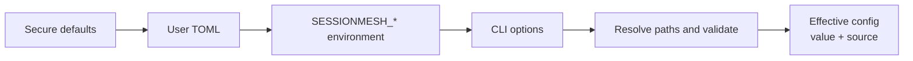

# Configuration

SessionMesh resolves typed configuration in one deterministic order:



A value from a higher layer replaces a lower value. If that higher value is
invalid, startup fails with the field and responsible layer; SessionMesh never
silently falls back.

## Locations

The native user configuration is:

```text
~/.config/sessionmesh/config.toml
```

The native state home defaults to:

```text
~/.local/share/sessionmesh
```

Containers set:

```text
SESSIONMESH_HOME=/var/lib/sessionmesh
```

The database and blob store default to `sessionmesh.db` and `blobs` below the
effective SessionMesh home.

## Security defaults

| Setting                 | Default     | Reason                           |
| ----------------------- | ----------- | -------------------------------- |
| `bind_address`          | `127.0.0.1` | Do not expose local session data |
| `port`                  | `8787`      | Stable local service port        |
| `allow_network`         | `false`     | Require explicit remote opt-in   |
| `redaction_enabled`     | `true`      | Protect derived processing       |
| `watch_debounce_ms`     | `750`       | Coalesce filesystem event bursts |
| `token_budget`          | `4000`      | Bound generated handoffs         |
| `correlation_threshold` | `0.8`       | Avoid weak automatic links       |

A non-loopback bind address or remote model endpoint requires
`allow_network = true`. Model endpoints accept only HTTP or HTTPS.

## Environment variables

| Variable                            | Field                       |
| ----------------------------------- | --------------------------- |
| `SESSIONMESH_HOME`                  | State home                  |
| `SESSIONMESH_BIND_ADDRESS`          | API bind address            |
| `SESSIONMESH_PORT`                  | API port                    |
| `SESSIONMESH_ALLOW_NETWORK`         | Network opt-in              |
| `SESSIONMESH_DATABASE_PATH`         | SQLite path                 |
| `SESSIONMESH_BLOB_STORE_PATH`       | Blob-store path             |
| `SESSIONMESH_WATCH_DEBOUNCE_MS`     | Watch debounce              |
| `SESSIONMESH_REDACTION_ENABLED`     | Redaction toggle            |
| `SESSIONMESH_EMBEDDING_ENDPOINT`    | Embedding endpoint          |
| `SESSIONMESH_LLM_ENDPOINT`          | Extraction/handoff endpoint |
| `SESSIONMESH_MODEL`                 | Model identifier            |
| `SESSIONMESH_TOKEN_BUDGET`          | Handoff budget              |
| `SESSIONMESH_CORRELATION_THRESHOLD` | Automatic-link threshold    |

## Path expansion

Paths support:

- `~` and `~/...` using the explicitly supplied user home;
- `$NAME`; and
- `${NAME}`.

Undefined variables and malformed references are errors. Shell substitution,
commands, glob evaluation, and arbitrary expressions are never executed.

## Container source mapping

Container paths and host provenance remain distinct:

```toml
[[source_mappings]]
readable_path = "/sources/codex"
original_path = "~/.codex"
```

Collectors read `readable_path`. Events retain the expanded `original_path` as
their user-facing provenance label.

## Schema

The public shape is described by the repository file
`schemas/config.schema.json`. The Rust resolver additionally enforces
cross-field security rules that JSON Schema cannot safely express in isolation.
