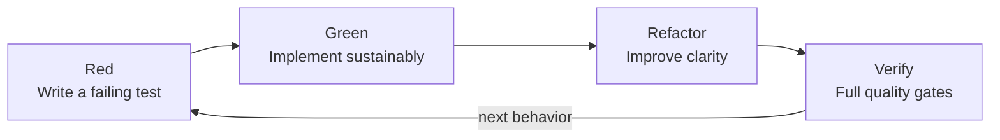

# Engineering Standards

## Language

All repository artifacts use English by default, including code, comments,
documentation, tests, UI text, ADRs, change notes, and commit messages.

## Git workflow

Direct commits and pushes to `main` are prohibited. Each change is developed
and published on a purpose-specific branch, synchronized with the current
remote default branch, and integrated through a reviewed pull request. Shared
history must not be rewritten without explicit approval.

## Test-driven development



Behavioral work follows red–green–refactor:

1. Add a focused test that fails for the intended reason.
2. Implement the smallest sustainable solution.
3. Refactor for clarity while the suite remains green.
4. Add boundary-level integration tests when data crosses modules, processes,
   storage, protocols, or the browser API.

Tests must cover failure behavior, not only successful input. Parsers require
fixtures for unknown events, malformed records, partial records, rotations, and
idempotent reprocessing.

## Clean and human-readable code

Use explicit names, cohesive modules, narrow responsibilities, and readable
formatting. Avoid compressed expressions and speculative optimizations. The
code should explain the mechanism; documentation comments should explain the
contract and the reason.

Public APIs and relevant functions require comments that capture at least one
of:

- their purpose in the system;
- invariants and safety boundaries;
- why the behavior is architecturally important;
- non-obvious input, output, error, or concurrency behavior; or
- provenance and data-retention implications.

Redundant comments that merely translate syntax into prose are discouraged.

## Root-cause policy

Investigate failures before editing behavior. Preserve diagnostic evidence and
identify the layer that violates its contract. Retries, fallbacks, ignored
errors, special-case conditionals, and skipped tests are not acceptable
substitutes for a cause-level fix.

Temporary mitigations need explicit approval, bounded behavior, tests,
documentation, a follow-up task, and an ADR when they change architectural
expectations.

## Documentation definition of done

Every change updates the relevant MkDocs pages and the
[changelog](../changes/changelog.md). Architecture changes add or supersede an
ADR. Interface examples, schemas, configuration, operational instructions, and
security implications must match the implementation.

The documentation gate is:

```bash
mkdocs build --strict
```
