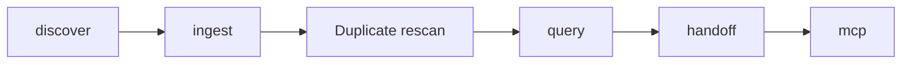

# MVP performance baseline

The baseline is a reproducible guardrail, not a production benchmark. It uses
the sanitized Codex rollout fixture on the current development host and inside
the pinned OCI toolchain.

## Measured journey

The automated end-to-end test records a five-second upper bound for discovery,
initial import, and duplicate rescan of the small fixture. It also asserts:

- duplicate rescan adds zero canonical events;
- every ingested event references an immutable raw object;
- native bytes are unchanged;
- handoff generation fits 4,000 approximate tokens; and
- MCP retrieves the stored compact handoff.

## Initial reference values

The following values were captured on 2026-07-20 from the release OCI image
with one sanitized eight-record Codex rollout. They are smoke-test references,
not capacity claims.

| Measure                              | Observed or bounded value |
| ------------------------------------ | ------------------------: |
| Native E2E including handoff and MCP |                    0.08 s |
| Discovery + import + rescan guard    |                     < 5 s |
| OCI steady-state memory              |                 19.01 MiB |
| SQLite database after import         |             262,144 bytes |
| Content-addressed blob directory     |               1,279 bytes |
| Local authenticated session query    |                  1.024 ms |
| REST list page                       |               ≤ 200 items |
| MCP search page                      |               ≤ 100 items |
| SSE client buffer                    |       128 event summaries |
| Handoff model timeout                |                      15 s |
| Default handoff budget               |  4,000 approximate tokens |

Database and blob growth are linear in unique native records. Duplicate scans
reuse deterministic event identities and content-addressed blobs. Release CI
should repeat these measurements with larger, redistributable fixtures before
performance claims or capacity targets are published.

## Known scaling limits

The MVP currently loads canonical events before API sorting, polls Codex
discovery at the configured debounce interval, and uses SQLite FTS5 without a
separate vector index. These are explicit roadmap targets; limits are bounded
at external pagination and streaming surfaces but internal large-store query
optimization remains post-MVP.
