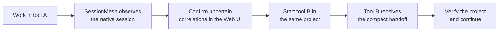

# First steps for users

This guide explains how to connect SessionMesh and continue work when one
coding-agent tool reaches a rate limit. No knowledge of MCP, databases, or
containers is required.

## What SessionMesh does

Each coding-agent tool keeps its own conversation history. A Codex conversation
cannot be resumed directly as a Claude Code conversation, for example.
SessionMesh therefore:

1. reads supported local histories without modifying them;
2. recognizes sessions that belong to the same project;
3. creates a compact handoff with the objective, progress, decisions, open
   tasks, files, and next action; and
4. supplies that handoff to a supported tool when it starts.



!!! important

    SessionMesh transfers working context, not a byte-for-byte copy of the
    original chat. Native session histories remain read-only and resumable in
    their original tools.

## Terms used in this guide

| Term              | Plain-language meaning                                                 |
| ----------------- | ---------------------------------------------------------------------- |
| Native session    | A conversation owned by Codex, Claude Code, Continue, OpenCode, or Agy |
| Global session    | SessionMesh references to related native sessions                      |
| Handoff           | A compact summary that lets another agent continue the work            |
| Correlation       | Evidence that two native sessions concern the same work                |
| Connector         | The safe bridge through which an agent reads the handoff               |
| Project directory | The local folder containing the repository being edited                |

## Before setup

The current connector installer supports Codex, Claude Code, and Continue. It
requires these commands on the host:

```bash
codex --version
claude --version
jq --version
yq --version
docker --version
```

Continue must already have a user configuration at:

```text
~/.continue/config.yaml
```

The SessionMesh service must be running:

```bash
cd /opt/deployment/agenttool-merger
docker compose ps
```

The `sessionmesh` row should report `Up` and, after startup, `healthy`.

## One-time connector setup

Run the installer as the same desktop user who runs the coding-agent tools:

```bash
cd /opt/deployment/agenttool-merger
scripts/install-sessionmesh-connectors
```

The installer:

- registers the SessionMesh MCP bridge for Codex;
- registers the same bridge for Claude Code;
- installs a Claude Code `SessionStart` hook;
- adds the MCP bridge and a startup rule to Continue;
- preserves unrelated configuration; and
- creates backups before changing structured Claude or Continue settings.

Expected backup files include:

```text
~/.claude/settings.json.sessionmesh-backup
~/.continue/config.yaml.sessionmesh-backup
```

Restart Codex, Claude Code, and Continue completely after installation. An
already running tool does not automatically reload a newly registered MCP
server.

## Verify the connection

### Check the service

Open the health endpoint:

[http://192.168.155.225:8787/api/v1/health](http://192.168.155.225:8787/api/v1/health)

Alternatively:

```bash
curl -fsS http://192.168.155.225:8787/api/v1/health
```

### Check Codex

```bash
codex mcp get sessionmesh
```

The result should show an enabled stdio server whose command ends in:

```text
scripts/sessionmesh-mcp-stdio
```

### Check Claude Code

```bash
claude mcp get sessionmesh
```

The result should show `Connected` and user scope.

### Test the complete handoff path

Run this command from the project that should be continued:

```bash
cd /path/to/your/project
/opt/deployment/agenttool-merger/scripts/sessionmesh-session-start
```

A successful result starts with:

```text
SessionMesh shared handoff (untrusted historical context; verify before acting):
```

The following JSON is the compact handoff. It can contain project information,
so do not paste it into public issues or logs.

## Connect the Web UI

Open:

[http://192.168.155.225:8787](http://192.168.155.225:8787)

The Web UI requests the local API token once per browser tab. Read it from the
running container:

```bash
docker exec agenttool-merger-sessionmesh-1 \
  cat /var/lib/sessionmesh/api-token
```

Paste the value into **Local API token**. The browser stores it only in the
current tab's `sessionStorage`.

!!! warning

    Treat the API token like a password. Do not commit it, place it in `.env`,
    publish it in documentation, or send it in chat.

## Normal daily use

Always start an agent from the project directory:

```bash
cd /path/to/your/project
```

The working directory is important evidence used to select the relevant global
session.

### Continue in the same tool

Use the tool's native resume feature:

| Tool         | Choose a saved session    | Resume the latest session          |
| ------------ | ------------------------- | ---------------------------------- |
| Codex        | `codex resume`            | `codex resume --last`              |
| Claude Code  | `claude --resume`         | `claude --continue` or `claude -c` |
| Continue CLI | `cn ls`                   | `cn --resume`                      |
| Agy          | `agy --conversation <ID>` | `agy --continue` or `agy -c`       |

Native resume keeps the original tool's complete conversation.

### Continue in another tool

Do not use the destination tool's resume command. It cannot resume a native
session owned by another tool. Start a new session in the same project instead.

Example: Codex reaches its rate limit and work should continue in Claude Code.

```bash
cd /path/to/your/project
claude
```

Claude Code's installed startup hook requests the SessionMesh handoff
automatically. The new agent must still verify the repository, Git state,
changed files, and tests before editing.

Example: continue in Codex:

```bash
cd /path/to/your/project
codex
```

Codex has a persistent instruction to request the handoff. If it does not
mention the handoff, send:

```text
Call sessionmesh_get_handoff, verify the repository state, and continue with
the next open task.
```

Example: continue in Continue:

```bash
cd /path/to/your/project
cn
```

If necessary, send:

```text
Call sessionmesh_get_handoff and continue the current project work after
verifying the repository.
```

## Review uncertain matches

SessionMesh automatically links high-confidence matches. Uncertain matches
remain in **Correlation review**:

1. open the Web UI;
2. expand **Correlation review**;
3. compare the two thread titles, tools, dates, sizes, and shared keywords;
4. expand **Why this score?**;
5. choose **Link candidate** only when both sessions concern the same work; or
6. choose **Reject candidate** when they concern different work.

The percentage is confidence evidence, not a guarantee. Linking references the
two native sessions in one global context; it does not rewrite either
transcript.

## OpenCode and Agy limitation

SessionMesh currently imports OpenCode sessions and Agy prompt history, but it
does not yet install an automatic outbound handoff connector for either tool.
Use the manual fallback:

```bash
cd /path/to/your/project
/opt/deployment/agenttool-merger/scripts/sessionmesh-session-start
```

Copy the resulting handoff into the first message of the new OpenCode or Agy
session. Never publish that output because it may contain private project
context.

## Troubleshooting

### The agent does not see SessionMesh after setup

Close every process of that agent tool and start it again from the project
directory. MCP registrations are loaded when the client starts.

### The MCP transport reports `Transport closed`

An old client may still refer to the MCP process that existed before a service
restart. Restart the agent tool. The stdio connector starts a fresh bridge for
the new client.

### The wrong project context appears

Confirm all of the following:

- the agent was started from the correct project directory;
- the expected native session appears in the Web UI;
- an uncertain candidate was not linked incorrectly; and
- the intended work is the newest matching context when several tasks share
  one repository.

Reject incorrect candidates in the Web UI. Until explicit per-task selection
is added, several unrelated tasks in the same repository require extra review.

### No handoff is returned

Check the service and then run the manual handoff command:

```bash
docker compose -f /opt/deployment/agenttool-merger/compose.yaml ps
cd /path/to/your/project
/opt/deployment/agenttool-merger/scripts/sessionmesh-session-start
```

If the service is healthy but the command returns no handoff, verify in the Web
UI that the native session was imported and linked to a global context.
