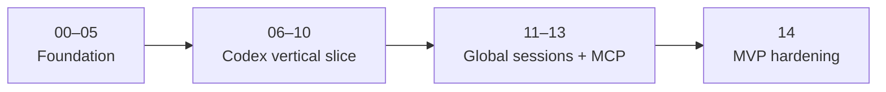

# Implementation Prompt Queue

These prompts turn Milestones 0–2 into an ordered, test-driven implementation
runbook. Execute them in numeric order and use the
[implementation ledger](../../development/implementation-status.md) as the
source of truth.

## Execution contract

For every prompt:

1. mark it `in_progress` in the ledger;
2. inspect current repository state and its dependencies;
3. follow red–green–refactor;
4. fix root causes rather than masking failures;
5. update relevant MkDocs pages and the changelog;
6. run the listed quality gates; and
7. record results, risks, revision, and the exact next prompt.

Do not start downstream behavior early. A minimal compile-time seam is allowed
only when required to complete the active prompt cleanly.
