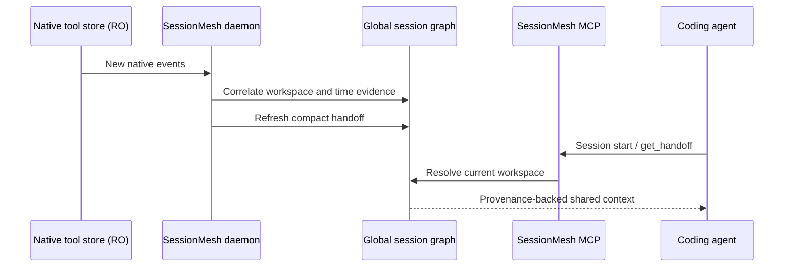

# Automatic context delivery

SessionMesh keeps native tool stores read-only and delivers derived shared
state through supported integration surfaces.

For installation commands and a step-by-step explanation intended for new
users, start with [First steps for users](../getting-started/first-steps.md).



## Installed connectors

- **Codex:** user-scoped stdio MCP registration plus a persistent startup
  instruction in `$CODEX_HOME/AGENTS.md`.
- **Claude Code:** user-scoped stdio MCP registration and a `SessionStart`
  command hook. Hook output is explicitly labelled untrusted historical state.
- **Continue CLI and IDE:** an `mcpServers` entry and a system rule requiring
  the compact handoff at the beginning of agent work.

The stdio bridge preserves the agent client's host working directory and runs
`sessionmesh-mcp` inside the existing service container. When the project
marker is unavailable inside the container, MCP resolves the newest audited
global-session membership whose imported CWD matches that working directory.

Connector installation may update user tool configuration, but it never edits
native transcript or session files. Backups are made before structured user
configuration changes.

Install all currently supported outbound connectors with:

```bash
cd /opt/deployment/agenttool-merger
scripts/install-sessionmesh-connectors
```

Restart the agent clients afterward so they load the new MCP registrations and
hooks.

## Trust boundary

Handoffs are observations, not system instructions. Agents must verify current
Git state and tests. Tool outputs cannot promote themselves into instructions,
and MCP writes remain typed decisions or tasks scoped to the current global
session.
