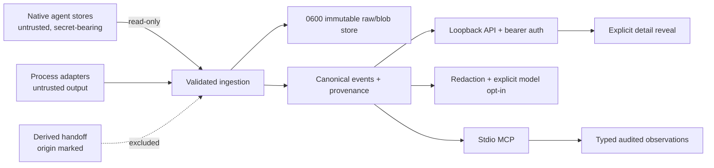

# MVP threat model

This threat model covers Milestones 0–2 and assumes a single trusted operating
system user. It does not claim protection from a fully compromised user
account.

## Boundaries and controls

| Boundary          | Primary threats                                         | Controls                                                              |
| ----------------- | ------------------------------------------------------- | --------------------------------------------------------------------- |
| Native paths      | Modification, traversal, symlink aliasing               | Read-only opens/mounts, canonical identity, no native write API       |
| JSON/JSONL        | Malformed lines, huge partial records, injection text   | Record isolation, bounded cursors, data-only diagnostics              |
| SQLite/blob store | Partial commit, tampering, broad permissions            | WAL transaction, content hashes, `0600` files, `0700` directories     |
| Local HTTP        | Other-origin reads/writes, secret listing, remote bind  | Loopback default, bearer token, safe projections, explicit opt-in     |
| Raw/detail UI     | Accidental prompt, output, or credential disclosure     | No preload, explicit warning/reveal, tab-scoped token                 |
| MCP stdio         | Unauthorized writes, scope escape, duplicate mutation   | Host process opt-in, strict schemas, current-scope check, request IDs |
| Model endpoint    | Secret egress, timeout, malformed or adversarial output | Redaction, network opt-in, timeout, strict JSON, fallback only        |
| Derived context   | Handoff ingestion loops, instruction smuggling          | Origin/version marker, ingestion exclusion, observation typing        |
| Adapter processes | Arbitrary scripts, unbounded output                     | Versioned protocol, explicit approval, bounded messages               |

## Residual risks

- Raw native content is intentionally retained and is readable by the owning
  OS user. Optional at-rest encryption is post-MVP.
- The lightweight redactor recognizes common secret patterns but is not a
  proof that arbitrary sensitive prose is removed. Remote model use should
  remain disabled for sensitive repositories.
- Browser `sessionStorage` protects against persistence, not malicious scripts
  executing in the same origin. SessionMesh must not host third-party scripts.
- Poll-based Codex discovery trades minimal complexity for bounded detection
  latency. Very large stores need later indexing and watcher optimization.
- Stdio write authorization trusts the MCP host process. Multi-user OAuth and
  role-based permissions are outside the local single-user MVP.

## Security regression expectations

Release validation verifies loopback publishing, non-root OCI execution,
read-only source mounts, user-only state permissions, token exclusion from
Git, payload-free list responses, prompt-injection classification, malformed
input isolation, and byte-for-byte native-source preservation.
