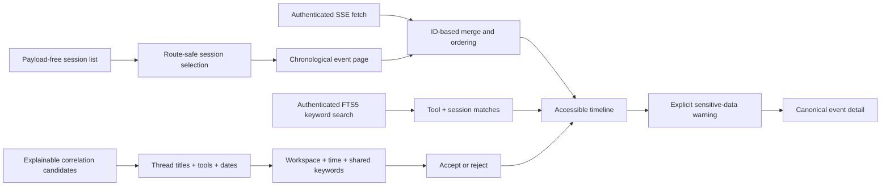

# Session timeline

The web interface presents the Codex vertical slice as a native-session list
and a deterministic event timeline. It uses the same-origin, authenticated
REST API for initial data and the resumable SSE stream for live updates.



## Connecting

On first use, enter the token stored at
`$SESSIONMESH_HOME/api-token`. The browser retains it in `sessionStorage`, so
it is limited to the current tab session and is neither embedded in the build
nor persisted in repository configuration. The UI and API must share an
origin.

For native development, build the application and point the daemon at it:

```bash
npm run build
SESSIONMESH_WEB_ROOT=apps/web/dist sessionmesh-daemon
```

The OCI image already uses `/usr/share/sessionmesh/web`.

## Timeline behavior

- Session identity is encoded through `URLSearchParams`; arbitrary native IDs
  cannot alter API paths.
- Session navigation uses the native thread title when an adapter supplies it,
  otherwise a bounded first user message and finally the native ID. The native
  ID remains available as the button tooltip and API identity.
- Sessions can be sorted by topic, latest observed date, or normalized content
  size and grouped by exact topic, calendar date, or documented size bands.
- The navigation is a bounded, scrollable tree. Tool-family branches contain
  collapsible grouping branches with result counts, while only the branch of
  the active session starts expanded. A local title/tool/native-ID filter opens
  matching branches without requesting or exposing event payloads.
- Initial and live events are deduplicated by deterministic event ID and
  restored to timestamp, native-sequence, and ID order.
- Adjacent tool calls and results are visually grouped without removing either
  item from chronology.
- Unknown kinds remain visible instead of failing the page.
- Reconnects send `Last-Event-ID`; stale content remains visible and clearly
  marked during recovery.
- Long details use a bounded, keyboard-focusable scrolling region.
- “Show timeline content” performs one explicit sensitive-data confirmation,
  then loads human-readable message, command, and output fields for every
  visible event. Full canonical JSON remains available in a disclosure.
- Keyword search spans all imported canonical events and labels every match
  with its agent tool, native session ID, event kind, excerpt, and provenance
  path. Selecting a result opens that native session.
- Correlation Review is a collapsible queue that initially renders at most five
  pending candidates. A local filter matches thread titles, tool families, and
  native IDs; additional results are disclosed in bounded five-item steps.
- Every percentage explicitly compares two context cards. Each card shows the
  tool and surface, thread title, latest observed date, normalized size, event
  count, and native ID. The expandable score explanation shows workspace
  agreement, temporal distance, lexical similarity, and up to twelve
  deterministic shared keywords. The daemon recomputes pending derived
  evidence after startup so stored candidates adopt the current explainability
  schema; manually accepted or rejected decisions remain unchanged.
- Accept and reject actions remain authenticated, audited, and immediately
  persisted. Accepting creates reference-only global-session membership; it
  does not merge or mutate native transcripts.
- The layout becomes a horizontally scrollable session selector on narrow
  screens and honors reduced-motion preferences.

## Privacy boundary

List and streaming responses never include event payloads. Selecting “Reveal
event data” opens a warning before the browser requests canonical payload and
provenance. This detail can contain prompts, commands, paths, or secret values.
It is intentionally neither preloaded nor cached as timeline summary data.

The authenticated search endpoint returns a bounded normalized content excerpt
and provenance path because search is an explicit content-retrieval action.
Search results may therefore contain sensitive session data and must not be
shared or exposed beyond the trusted network.

The current detail endpoint does not expose immutable native raw bytes. Those
remain in the content-addressed raw store for provenance and later controlled
inspection.
