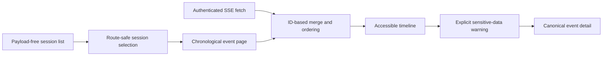

# Session timeline

The web interface presents the Codex vertical slice as a native-session list
and a deterministic event timeline. It uses the same-origin, authenticated
REST API for initial data and the resumable SSE stream for live updates.



## Connecting

On first use, enter the token stored at
`$SESSIONMESH_HOME/api-token`. The browser retains it in `sessionStorage`, so
it is limited to the current tab session and is neither embedded in the build
nor persisted in repository configuration. The UI and API must share an
origin.

For native development, build the application and point the daemon at it:

```bash
npm run build
SESSIONMESH_WEB_ROOT=apps/web/dist sessionmesh-daemon
```

The OCI image already uses `/usr/share/sessionmesh/web`.

## Timeline behavior

- Session identity is encoded through `URLSearchParams`; arbitrary native IDs
  cannot alter API paths.
- Initial and live events are deduplicated by deterministic event ID and
  restored to timestamp, native-sequence, and ID order.
- Adjacent tool calls and results are visually grouped without removing either
  item from chronology.
- Unknown kinds remain visible instead of failing the page.
- Reconnects send `Last-Event-ID`; stale content remains visible and clearly
  marked during recovery.
- Long details use a bounded, keyboard-focusable scrolling region.
- The layout becomes a horizontally scrollable session selector on narrow
  screens and honors reduced-motion preferences.

## Privacy boundary

List and streaming responses never include event payloads. Selecting “Reveal
event data” opens a warning before the browser requests canonical payload and
provenance. This detail can contain prompts, commands, paths, or secret values.
It is intentionally neither preloaded nor cached as timeline summary data.

The current detail endpoint does not expose immutable native raw bytes. Those
remain in the content-addressed raw store for provenance and later controlled
inspection.
